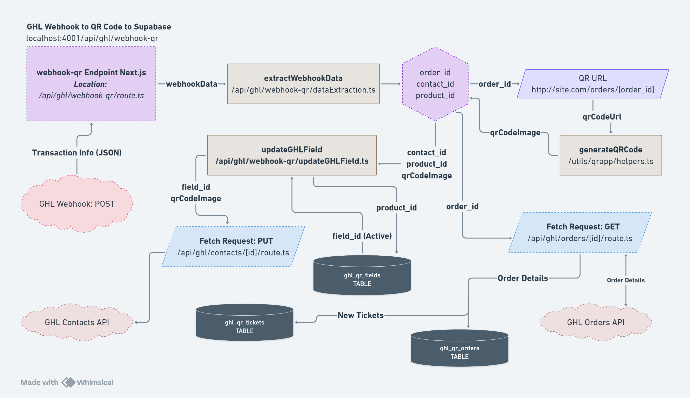

# Data Flow Architecture

This document describes how data flows through the QR Project V3 system, including order processing, QR code generation, webhook handling, and real-time synchronization.

---

## Overview

The QR Project V3 handles three primary data flows:

1. **Webhook-Triggered Flow** - New orders from GHL trigger QR code generation
2. **Manual Sync Flow** - Admin-initiated synchronization of order data
3. **Ticket Validation Flow** - Updating ticket status for access control

---

## 1. Webhook-Triggered Data Flow

When a new order is placed in GoHighLevel, the system automatically processes it and generates a QR code.



### Flow Sequence

```
┌─────────────┐
│  GHL Order  │
│   Created   │
└──────┬──────┘
       │ POST Webhook
       ▼
┌──────────────────────────────────┐
│ /api/ghl/webhook-qr/route.ts:1  │
│                                  │
│  1. Extract webhook data         │
│  2. Get order_id, contact_id     │
│  3. Get product_id               │
└──────┬───────────────────────────┘
       │
       ▼
┌──────────────────────────────────┐
│ extractWebhookData()             │
│ Location: /api/ghl/webhook-qr/  │
│           dataExtraction.ts:1    │
│                                  │
│  Parses JSON webhook payload     │
└──────┬───────────────────────────┘
       │
       ├─────────────┬──────────────┐
       │             │              │
       ▼             ▼              ▼
  order_id     contact_id     product_id
       │             │              │
       └─────────────┴──────────────┘
                     │
                     ▼
      ┌──────────────────────────────┐
      │ generateQRCode()             │
      │ Location: utils/qrapp/       │
      │           helpers.ts:1       │
      │                              │
      │  QR URL Format:              │
      │  https://qr.site.com/orders/ │
      │  {order_id}                  │
      └──────┬───────────────────────┘
             │
             ▼
      ┌──────────────────────────────┐
      │  Base64 Data URL             │
      │  "data:image/png;base64,..." │
      └──────┬───────────────────────┘
             │
             ▼
      ┌──────────────────────────────┐
      │ updateGHLField()             │
      │ Location: /api/ghl/webhook-qr│
      │           /updateGHLField.ts:1│
      │                              │
      │  PUT /contacts/{contact_id}  │
      │  Update custom field with QR │
      └──────┬───────────────────────┘
             │
             ▼
      ┌──────────────────────────────┐
      │  GHL Contact Updated         │
      │  Custom field now contains   │
      │  QR code image (base64)      │
      └──────────────────────────────┘
             │
             ▼
      ┌──────────────────────────────┐
      │  Async: Trigger Order Sync   │
      │  GET /api/ghl/orders/[id]    │
      │  Fetch order details and     │
      │  save to Supabase            │
      └──────┬───────────────────────┘
             │
             ▼
      ┌──────────────────────────────┐
      │  Supabase Database           │
      │  - ghl_qr_orders (insert)    │
      │  - ghl_qr_tickets (insert)   │
      └──────────────────────────────┘
```

### Code Implementation

#### 1. Webhook Endpoint

```typescript
// app/api/ghl/webhook-qr/route.ts:1
export async function POST(request: NextRequest) {
  try {
    const webhookData = await request.json();

    // Extract order information
    const { order_id, contact_id, product_id } =
      extractWebhookData(webhookData);

    // Generate QR code
    const qrCodeUrl = `https://qr.cyberizedev.com/orders/${order_id}`;
    const qrCodeImage = await generateQRCode(qrCodeUrl);

    // Update GHL contact with QR code
    await updateGHLField(contact_id, product_id, qrCodeImage);

    // Trigger async order sync (non-blocking)
    fetch(`${API_URL}/api/ghl/orders/${order_id}`).catch(console.error);

    return NextResponse.json({ success: true });
  } catch (error) {
    logger.error('Webhook processing failed:', error);
    return NextResponse.json({ error: 'Failed' }, { status: 500 });
  }
}
```

#### 2. QR Code Generation

```typescript
// utils/qrapp/helpers.ts:1
import QRCode from 'qrcode';

export const generateQRCode = async (text: string): Promise<string> => {
  try {
    // Generate QR code as base64 data URL
    const qrCodeDataUrl = await QRCode.toDataURL(text, {
      errorCorrectionLevel: 'H',
      type: 'image/png',
      width: 300,
      margin: 1,
    });

    return qrCodeDataUrl; // "data:image/png;base64,..."
  } catch (error) {
    throw new Error('QR code generation failed');
  }
};
```

#### 3. GHL Field Update

```typescript
// app/api/ghl/webhook-qr/updateGHLField.ts:1
export const updateGHLField = async (
  contactId: string,
  productId: string,
  qrCodeImage: string
) => {
  // Get the custom field ID for this product
  const { data: fieldData } = await supabase
    .from('ghl_qr_fields')
    .select('field_id')
    .eq('product_id', productId)
    .single();

  if (!fieldData) {
    throw new Error('Field mapping not found');
  }

  // Update GHL contact
  const response = await fetch(
    `${GHL_API_BASE_URL}/contacts/${contactId}`,
    {
      method: 'PUT',
      headers: {
        'Authorization': `Bearer ${GHL_ACCESS_TOKEN}`,
        'Content-Type': 'application/json',
        'Version': '2021-07-28',
      },
      body: JSON.stringify({
        customFields: [
          {
            id: fieldData.field_id,
            value: qrCodeImage, // Base64 image
          },
        ],
      }),
    }
  );

  if (!response.ok) {
    throw new Error('Failed to update GHL contact');
  }
};
```

---

## 2. Manual Sync Data Flow

Admins can manually trigger a full synchronization of orders from GHL to Supabase with real-time progress updates via Socket.IO.


### Flow Sequence

```
┌───────────────────────────┐
│  Admin Portal UI          │
│  Click "Sync" Button      │
└──────────┬────────────────┘
           │
           ▼
┌───────────────────────────────────┐
│  SyncButtonBlock Component        │
│  Location: components/admin/      │
│           sync-button/            │
│           SyncButtonBlock.tsx:1   │
│                                   │
│  handleSyncClick()                │
└──────────┬────────────────────────┘
           │
           ▼
┌───────────────────────────────────┐
│  Socket.IO Client                 │
│  Listen for events:               │
│  - sync_status                    │
│  - sync_progress                  │
│  - sync_complete                  │
└──────────┬────────────────────────┘
           │
           ▼
┌───────────────────────────────────┐
│  GET /api/ghl/orders/sync         │
│  Location: app/api/ghl/orders/    │
│           sync/route.ts:1         │
│                                   │
│  Triggers syncOrders()            │
└──────────┬────────────────────────┘
           │
           ▼
┌───────────────────────────────────┐
│  syncOrders()                     │
│  Location: app/api/ghl/orders/    │
│           sync/syncOrders.ts:1    │
│                                   │
│  1. Read valid_order_list.json   │
│  2. Loop through order IDs        │
│  3. Fetch from GHL API            │
│  4. Upsert to Supabase            │
│  5. Emit Socket.IO progress       │
└──────────┬────────────────────────┘
           │
           ▼
┌─────────────────────────────────────────┐
│  For Each Order:                        │
│                                         │
│  ┌────────────────────────────────┐    │
│  │ fetchGhlOrderDetails(orderId)  │    │
│  │ Location: services/            │    │
│  │           ghlServices.ts:1     │    │
│  │                                │    │
│  │ GET /payments/orders/{id}      │    │
│  └────────────┬───────────────────┘    │
│               │                         │
│               ▼                         │
│  ┌────────────────────────────────┐    │
│  │  Extract Order Data            │    │
│  │  - Contact info                │    │
│  │  - Event/product info          │    │
│  │  - Ticket quantities           │    │
│  │  - Payment info                │    │
│  └────────────┬───────────────────┘    │
│               │                         │
│               ▼                         │
│  ┌────────────────────────────────┐    │
│  │  Supabase Upsert               │    │
│  │  ghl_qr_orders.upsert({...})   │    │
│  └────────────┬───────────────────┘    │
│               │                         │
│               ▼                         │
│  ┌────────────────────────────────┐    │
│  │  Emit sync_progress            │    │
│  │  io.emit('sync_progress', {    │    │
│  │    syncedOrders: count,        │    │
│  │    totalOrders: total          │    │
│  │  })                            │    │
│  └────────────────────────────────┘    │
└─────────────────────────────────────────┘
           │
           ▼
┌───────────────────────────────────┐
│  syncTickets()                    │
│  Location: app/api/ghl/orders/    │
│           sync/syncTickets.ts:1   │
│                                   │
│  For each order:                  │
│  1. Get ticket_quantities (JSONB) │
│  2. Calculate total needed        │
│  3. Check existing tickets        │
│  4. Insert missing tickets        │
│  5. Emit Socket.IO progress       │
└──────────┬────────────────────────┘
           │
           ▼
┌───────────────────────────────────┐
│  Write sync_status.json           │
│  Location: public/sync_status.json│
│                                   │
│  {                                │
│    status: "Delay",               │
│    syncInProgress: false          │
│  }                                │
└──────────┬────────────────────────┘
           │
           ▼
┌───────────────────────────────────┐
│  Emit sync_complete               │
│  io.emit('sync_complete')         │
└──────────┬────────────────────────┘
           │
           ▼
┌───────────────────────────────────┐
│  UI Updates                       │
│  - Hide progress dialog           │
│  - Show delay dialog (5 seconds)  │
│  - Refresh order data             │
└───────────────────────────────────┘
```

### Code Implementation

#### 1. Sync Button

```typescript
// components/admin/sync-button/SyncButtonBlock.tsx:1
'use client';

import { useState, useEffect } from 'react';
import { useSyncStore } from '@/store/useSyncStore';
import { io } from 'socket.io-client';

export const SyncButtonBlock = () => {
  const { syncStatus, fetchSyncStatus, updateSyncStatus } = useSyncStore();
  const [socket, setSocket] = useState(null);

  useEffect(() => {
    // Connect to Socket.IO
    const socketInstance = io(process.env.NEXT_PUBLIC_SOCKET_URL);
    setSocket(socketInstance);

    // Listen for sync events
    socketInstance.on('sync_status', (data) => {
      updateSyncStatus(data);
    });

    socketInstance.on('sync_progress', (data) => {
      updateSyncStatus(data);
    });

    socketInstance.on('sync_complete', () => {
      updateSyncStatus({ syncInProgress: false, status: 'Delay' });
    });

    return () => socketInstance.disconnect();
  }, []);

  const handleSyncClick = async () => {
    try {
      // Trigger sync
      await fetch('/api/ghl/orders/sync');
    } catch (error) {
      console.error('Sync failed:', error);
    }
  };

  return (
    <Button onClick={handleSyncClick} disabled={syncStatus.syncInProgress}>
      {syncStatus.syncInProgress ? 'Syncing...' : 'Sync Orders'}
    </Button>
  );
};
```

#### 2. Sync Orders Function

```typescript
// app/api/ghl/orders/sync/syncOrders.ts:6
export const syncOrders = async (
  supabase: SupabaseClient,
  logger: any,
  io: any
) => {
  // Read valid order IDs from JSON
  const validOrderListPath = path.join(
    process.cwd(),
    'public',
    'valid_order_list.json'
  );
  const validOrderIds = JSON.parse(
    fs.readFileSync(validOrderListPath, 'utf-8')
  );

  let ordersSynced = 0;
  let ticketQuantitiesArray = [];

  // Loop through each order
  for (const orderId of validOrderIds) {
    logger.info(`Starting sync for Order ID: ${orderId}`);

    // Fetch from GHL
    const orderDetails = await fetchGhlOrderDetails(orderId);
    if (!orderDetails) continue;

    // Calculate ticket quantities
    let ticketQuantities = {};
    for (const item of orderDetails.items) {
      const ticketType = item.price?.name;
      const qty = item.qty;
      if (!ticketQuantities[ticketType]) {
        ticketQuantities[ticketType] = 0;
      }
      ticketQuantities[ticketType] += qty;
    }

    // Upsert to Supabase
    await supabase.from('ghl_qr_orders').upsert({
      order_id: orderDetails._id,
      location_id: orderDetails.altId,
      total_paid: orderDetails.amount,
      payment_status: orderDetails.paymentStatus,
      contact_id: orderDetails.contactSnapshot?.id,
      contact_firstname: orderDetails.contactSnapshot?.firstName,
      contact_email: orderDetails.contactSnapshot?.email,
      event_id: orderDetails.items[0]?.product?._id,
      event_name: orderDetails.items[0]?.product?.name,
      ticket_quantities: ticketQuantities, // JSONB
    });

    ticketQuantitiesArray.push({ orderId, quantities: ticketQuantities });
    ordersSynced++;

    // Emit progress via Socket.IO
    if (io) {
      io.emit('sync_progress', {
        syncInProgress: true,
        totalOrders: validOrderIds.length,
        syncedOrders: ordersSynced,
        status: 'Syncing Orders',
      });
    }
  }

  return ticketQuantitiesArray;
};
```

#### 3. Sync Tickets Function

```typescript
// app/api/ghl/orders/sync/syncTickets.ts:1
export const syncTickets = async (
  supabase: SupabaseClient,
  ticketQuantitiesArray: Array<{ orderId: string; quantities: object }>,
  logger: any,
  io: any
) => {
  let ticketsSynced = 0;

  for (const { orderId, quantities } of ticketQuantitiesArray) {
    // Get existing tickets for this order
    const { data: existingTickets } = await supabase
      .from('ghl_qr_tickets')
      .select('*')
      .eq('order_id', orderId);

    // Calculate how many tickets needed
    const existingByType = {};
    for (const ticket of existingTickets) {
      existingByType[ticket.ticket_type] =
        (existingByType[ticket.ticket_type] || 0) + 1;
    }

    // Insert missing tickets
    for (const [ticketType, neededQty] of Object.entries(quantities)) {
      const existingQty = existingByType[ticketType] || 0;
      const missingQty = neededQty - existingQty;

      if (missingQty > 0) {
        const ticketsToInsert = Array.from({ length: missingQty }, () => ({
          order_id: orderId,
          ticket_type: ticketType,
          status: 'live',
        }));

        await supabase.from('ghl_qr_tickets').insert(ticketsToInsert);
      }
    }

    ticketsSynced++;

    // Emit progress
    if (io) {
      io.emit('sync_progress', {
        syncInProgress: true,
        totalOrders: ticketQuantitiesArray.length,
        syncedOrders: ticketsSynced,
        status: 'Syncing Tickets',
      });
    }
  }
};
```

---

## 3. Ticket Validation Flow

Admins can update ticket status to control event access.

```
┌───────────────────────────┐
│  Admin Views Order        │
│  /orders/[order_id]       │
└──────────┬────────────────┘
           │
           ▼
┌───────────────────────────────────┐
│  TicketTable Component            │
│  Location: components/admin/      │
│           single-order-page/      │
│           TicketTable.tsx:1       │
│                                   │
│  Displays all tickets for order   │
└──────────┬────────────────────────┘
           │
           ├──────────────┬──────────────┐
           │              │              │
      Bulk Update   Single Update   View Details
           │              │
           ▼              ▼
┌──────────────────┐  ┌──────────────────┐
│  Update All      │  │  Update Single   │
│  Tickets by      │  │  Ticket by ID    │
│  Order ID        │  │                  │
└────┬─────────────┘  └────┬─────────────┘
     │                     │
     ▼                     ▼
┌────────────────────────────────────────┐
│  PUT /api/qrapp/tickets/status/route.ts│
│  or                                    │
│  PUT /api/qrapp/tickets/status/[id]/  │
│       route.ts                         │
└────┬───────────────────────────────────┘
     │
     ▼
┌────────────────────────────────────────┐
│  updateTicketsStatusByOrderId()        │
│  or                                    │
│  updateTicketStatusById()              │
│  Location: services/ticketServices.ts:1│
└────┬───────────────────────────────────┘
     │
     ▼
┌────────────────────────────────────────┐
│  Supabase Update                       │
│  UPDATE ghl_qr_tickets                 │
│  SET status = $1                       │
│  WHERE order_id = $2                   │
│  or ticket_id = $2                     │
└────┬───────────────────────────────────┘
     │
     ▼
┌────────────────────────────────────────┐
│  UI Refresh                            │
│  Re-fetch tickets and update display   │
└────────────────────────────────────────┘
```

### Code Implementation

```typescript
// services/ticketServices.ts:1
export const updateTicketsStatusByOrderId = async (
  orderId: string,
  status: 'live' | 'used' | 'cancelled'
) => {
  const response = await fetch('/api/qrapp/tickets/status', {
    method: 'PUT',
    headers: { 'Content-Type': 'application/json' },
    body: JSON.stringify({ order_id: orderId, status }),
  });

  if (!response.ok) throw new Error('Failed to update tickets');
  return response.json();
};

export const updateTicketStatusById = async (
  ticketId: number,
  status: 'live' | 'used' | 'cancelled'
) => {
  const response = await fetch(`/api/qrapp/tickets/status/${ticketId}`, {
    method: 'PUT',
    headers: { 'Content-Type': 'application/json' },
    body: JSON.stringify({ status }),
  });

  if (!response.ok) throw new Error('Failed to update ticket');
  return response.json();
};
```

---

## Data Persistence Strategy

### Generated JSON Files

The application generates and reads JSON files for caching and coordination:

| File | Purpose | Location | Updated By |
|------|---------|----------|------------|
| `ticket_types.json` | Cached ticket types per event | `public/ticket_types.json` | Initial app load |
| `valid_order_list.json` | List of valid order IDs to sync | `public/valid_order_list.json` | Manual creation/update |
| `sync_status.json` | Current sync status | `public/sync_status.json` | Sync process |

#### Example: sync_status.json

```json
{
  "status": "Delay",
  "syncInProgress": false,
  "totalOrders": 45,
  "syncedOrders": 45,
  "lastSyncTime": "2024-12-31T10:30:00Z"
}
```

### Database Persistence

All order and ticket data persists in Supabase PostgreSQL:

- **ghl_qr_orders** - Order master data
- **ghl_qr_tickets** - Individual ticket records
- **ghl_qr_users** - User data
- **ghl_qr_fields** - Field mappings

---

## Real-Time Communication (Socket.IO)

### Server-Side Setup

```typescript
// server.js:1
const io = new Server(server);

// Make globally accessible
globalThis.io = io;

io.on('connection', (socket) => {
  console.log('Socket connected:', socket.id);

  socket.on('disconnect', () => {
    console.log('Socket disconnected:', socket.id);
  });
});
```

### Client-Side Connection

```typescript
// components/admin/sync-button/SyncButtonBlock.tsx:1
import { io } from 'socket.io-client';

useEffect(() => {
  const socket = io(process.env.NEXT_PUBLIC_SOCKET_URL);

  socket.on('sync_status', (data) => {
    console.log('Sync status:', data);
    updateSyncStatus(data);
  });

  socket.on('sync_progress', (data) => {
    console.log('Sync progress:', data);
    updateSyncStatus(data);
  });

  socket.on('sync_complete', () => {
    console.log('Sync complete');
    updateSyncStatus({ syncInProgress: false, status: 'Delay' });
  });

  return () => socket.disconnect();
}, []);
```

### Events Emitted

| Event | Payload | When | Purpose |
|-------|---------|------|---------|
| `sync_status` | `{ status, syncInProgress }` | Sync start | Initial status |
| `sync_progress` | `{ totalOrders, syncedOrders, status }` | After each order/ticket | Progress updates |
| `sync_complete` | `{}` | Sync end | Completion signal |

---

## Error Handling and Logging

### Winston Logger

All data flow operations are logged via Winston:

```typescript
// utils/logging/logger.ts:1
import winston from 'winston';

const logger = winston.createLogger({
  level: 'info',
  format: winston.format.json(),
  transports: [
    new winston.transports.File({
      filename: 'logs/ghl-order-sync/sync-{date}.log',
    }),
    new winston.transports.Console(),
  ],
});

export default logger;
```

### Usage in Sync

```typescript
logger.info('[Starting sync for Order ID:', orderId, ']');
logger.warn('[Order not found. Skipping.]');
logger.error('[Sync failed:]', error);
```

---

## Quick Reference

### Key Endpoints

| Endpoint | Method | Purpose |
|----------|--------|---------|
| `/api/ghl/webhook-qr` | POST | Receive GHL webhooks |
| `/api/ghl/orders/sync` | GET | Trigger manual sync |
| `/api/ghl/orders/[id]` | GET | Fetch single order |
| `/api/qrapp/tickets/status` | PUT | Update all tickets for order |
| `/api/qrapp/tickets/status/[id]` | PUT | Update single ticket |

### Key Functions

| Function | Location | Purpose |
|----------|----------|---------|
| `generateQRCode()` | `utils/qrapp/helpers.ts:1` | Generate QR code image |
| `updateGHLField()` | `/api/ghl/webhook-qr/updateGHLField.ts:1` | Update GHL contact |
| `syncOrders()` | `/api/ghl/orders/sync/syncOrders.ts:6` | Sync orders from GHL |
| `syncTickets()` | `/api/ghl/orders/sync/syncTickets.ts:1` | Sync tickets to DB |

---

## Related Documentation

- [System Overview](/docs/architecture/overview.md)
- [Webhook Integration](/docs/api/webhook-integration.md)
- [Data Synchronization Feature](/docs/features/data-synchronization.md)
- [QR Code Generation Feature](/docs/features/qr-code-generation.md)

---

**Last Updated:** December 31, 2025
