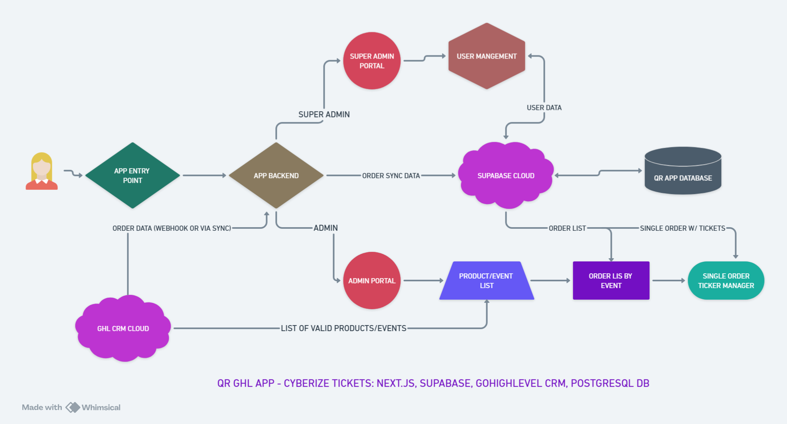

# System Architecture Overview

This document provides a comprehensive overview of the QR Project V3 system architecture, technology stack, and key design decisions.

---

## System Goals

The QR Project V3 is designed to:

1. **Automate Event Ticketing** - Manage events and ticket sales from GoHighLevel
2. **Generate QR Codes** - Automatically create QR codes for order validation
3. **Synchronize Data** - Bi-directional sync between GHL and Supabase in real-time
4. **Validate Tickets** - Allow admins to manage ticket status for event access control
5. **Manage Users** - Role-based access control with SuperAdmin, Admin, and Member roles

---

## High-Level Architecture



### Architecture Components

The system follows a modern full-stack architecture with clear separation of concerns:

```
┌─────────────────────────────────────────────────────────────┐
│                        CLIENT LAYER                          │
│  (Next.js 13 App Router + React 18 + TypeScript)            │
│                                                              │
│  ┌──────────────┐  ┌──────────────┐  ┌──────────────┐      │
│  │    Public    │  │     Auth     │  │   Protected  │      │
│  │    Routes    │  │    Routes    │  │    Routes    │      │
│  │  (/, /blog)  │  │   (/auth)    │  │ (Admin/Super)│      │
│  └──────────────┘  └──────────────┘  └──────────────┘      │
└─────────────────────────────────────────────────────────────┘
                            │
                            ▼
┌─────────────────────────────────────────────────────────────┐
│                    APPLICATION LAYER                         │
│      (Next.js API Routes + Express + Socket.IO)             │
│                                                              │
│  ┌──────────┐  ┌──────────┐  ┌──────────┐  ┌──────────┐   │
│  │   Auth   │  │   GHL    │  │  QR App  │  │SuperAdmin│   │
│  │   API    │  │   API    │  │   API    │  │   API    │   │
│  └──────────┘  └──────────┘  └──────────┘  └──────────┘   │
│                                                              │
│            ┌──────────────────────────────┐                 │
│            │   Socket.IO Server (Port     │                 │
│            │   4001) - Real-time Updates  │                 │
│            └──────────────────────────────┘                 │
└─────────────────────────────────────────────────────────────┘
                            │
                ┌───────────┴───────────┐
                ▼                       ▼
┌──────────────────────┐    ┌──────────────────────┐
│   SUPABASE CLOUD     │    │   GHL CRM CLOUD      │
│                      │    │                      │
│  ┌───────────────┐   │    │  ┌───────────────┐  │
│  │  PostgreSQL   │   │    │  │   Orders API  │  │
│  │   Database    │   │    │  │  Products API │  │
│  │               │   │    │  │  Contacts API │  │
│  │  - Orders     │   │    │  │   Webhooks    │  │
│  │  - Tickets    │   │    │  └───────────────┘  │
│  │  - Users      │   │    │                      │
│  │  - Fields     │   │    └──────────────────────┘
│  └───────────────┘   │
│                      │
│  ┌───────────────┐   │
│  │ Supabase Auth │   │
│  │  + RBAC       │   │
│  └───────────────┘   │
└──────────────────────┘
```

---

## Technology Stack

### Frontend Stack

| Technology | Version | Purpose |
|-----------|---------|---------|
| **Next.js** | 13.5.6 | React framework with App Router (RSC) |
| **React** | 18 | UI library |
| **TypeScript** | 5.6.2 | Type safety and developer experience |
| **Tailwind CSS** | 3.4.1 | Utility-first CSS framework |
| **Shadcn UI** | Latest | Radix UI-based component library |
| **Lucide React** | 0.394.0 | Icon library |
| **next-themes** | 0.3.0 | Dark mode support |

### Backend Stack

| Technology | Version | Purpose |
|-----------|---------|---------|
| **Next.js API Routes** | 13.5.6 | Serverless API endpoints |
| **Express.js** | 4.21.0 | Custom server for Socket.IO |
| **Socket.IO** | 4.8.0 | Real-time bidirectional communication |
| **Node.js** | 18+ | Runtime environment |

### Database & Authentication

| Technology | Version | Purpose |
|-----------|---------|---------|
| **Supabase** | Latest | PostgreSQL + Auth + Real-time |
| **@supabase/ssr** | 0.5.1 | Server-side rendering support |
| **@supabase/supabase-js** | 2.44.0 | Supabase client library |

### State Management

| Technology | Version | Purpose |
|-----------|---------|---------|
| **Zustand** | 4.5.4 | Global state management |
| **React Hook Form** | 7.51.5 | Form state management |
| **Zod** | 3.23.8 | Schema validation |

### External Integrations

| Integration | Purpose |
|------------|---------|
| **GoHighLevel API** | CRM integration for orders, contacts, events |
| **GHL Webhooks** | Real-time order notifications |
| **QRCode** (1.5.4) | QR code generation |

### Development Tools

| Tool | Purpose |
|------|---------|
| **Winston** | Server-side logging |
| **PM2** | Production process management |
| **ts-node** | TypeScript execution |

---

## Directory Structure

```
qr-project-nextjs13-shadcn-supabase-v3/
│
├── app/                          # Next.js 13 App Router
│   ├── (public)/                 # Public route group
│   │   ├── page.tsx              # Homepage: app/(public)/page.tsx:1
│   │   └── wp-blog/              # Blog routes
│   ├── (auth)/                   # Auth route group
│   │   ├── auth/                 # Login/signup: app/(auth)/auth/page.tsx:1
│   │   └── auth/pass-reset/      # Password reset
│   ├── (admin)/                  # Admin route group (protected)
│   │   ├── layout.tsx            # Admin layout with HOC: app/(admin)/layout.tsx:1
│   │   ├── admin-portal/         # Dashboard: app/(admin)/admin-portal/page.tsx:1
│   │   ├── events/[id]/          # Event details: app/(admin)/events/[id]/page.tsx:1
│   │   ├── orders/[id]/          # Order details: app/(admin)/orders/[id]/page.tsx:1
│   │   └── profile/[id]/         # User profile: app/(admin)/profile/[id]/page.tsx:1
│   ├── (superadmin)/             # SuperAdmin route group (protected)
│   │   ├── layout.tsx            # SuperAdmin layout: app/(superadmin)/layout.tsx:1
│   │   ├── superadmin-portal/    # Dashboard: app/(superadmin)/superadmin-portal/page.tsx:1
│   │   └── add-user/             # Add user: app/(superadmin)/add-user/page.tsx:1
│   ├── (members)/                # Members route group (protected)
│   │   └── members-portal/       # Dashboard: app/(members)/members-portal/page.tsx:1
│   ├── api/                      # API routes
│   │   ├── auth/                 # Authentication endpoints
│   │   │   ├── login/route.ts
│   │   │   ├── logout/route.ts
│   │   │   └── getUser/route.ts
│   │   ├── ghl/                  # GHL integration
│   │   │   ├── orders/route.ts
│   │   │   ├── webhook-qr/route.ts
│   │   │   └── events/route.ts
│   │   ├── qrapp/                # Internal app endpoints
│   │   │   ├── orders/route.ts
│   │   │   └── tickets/route.ts
│   │   └── superadmin/           # SuperAdmin endpoints
│   │       ├── add-user/route.ts
│   │       └── delete-user/route.ts
│   ├── providers/                # React Context providers
│   └── layout.tsx                # Root layout: app/layout.tsx:1
│
├── components/                   # React components
│   ├── ui/                       # Shadcn UI components
│   │   ├── button.tsx            # components/ui/button.tsx:1
│   │   ├── card.tsx
│   │   ├── dialog.tsx
│   │   └── ...                   # 20+ UI components
│   ├── admin/                    # Admin-specific components
│   │   ├── AdminSidebar.tsx      # components/admin/AdminSidebar.tsx:1
│   │   ├── EventItem.tsx
│   │   └── OrderList.tsx
│   ├── superadmin/               # SuperAdmin components
│   ├── global/                   # Global components
│   │   └── Navbar.tsx            # components/global/Navbar.tsx:1
│   ├── common/                   # Reusable components
│   └── auth/                     # Auth components
│       └── LoginForm.tsx         # components/auth/LoginForm.tsx:1
│
├── services/                     # Service layer (API calls)
│   ├── orderServices.ts          # services/orderServices.ts:1
│   ├── ticketServices.ts
│   ├── userServices.ts
│   ├── ghlServices.ts
│   ├── eventServices.ts
│   └── fieldServices.ts
│
├── store/                        # Zustand stores
│   ├── useAuthStore.ts           # store/useAuthStore.ts:1
│   ├── useGHLDataStore.ts
│   └── useSyncStore.ts
│
├── types/                        # TypeScript types
│   ├── custom.d.ts               # types/custom.d.ts:1
│   └── index.ts
│
├── utils/                        # Utilities
│   ├── supabase/                 # Supabase clients
│   │   ├── client.ts             # Browser client: utils/supabase/client.ts:1
│   │   ├── server.ts             # Server client: utils/supabase/server.ts:1
│   │   └── admin-client.ts       # Admin client: utils/supabase/admin-client.ts:1
│   ├── qrapp/
│   │   └── helpers.ts            # QR utilities: utils/qrapp/helpers.ts:1
│   └── logging/
│       └── logger.ts             # Winston logger: utils/logging/logger.ts:1
│
├── hoc/                          # Higher-Order Components
│   ├── withAdminProtection.tsx   # hoc/withAdminProtection.tsx:1
│   ├── withSuperAdminProtection.tsx
│   └── withMemberProtection.tsx
│
├── hooks/                        # Custom React hooks
│
├── lib/                          # Utility libraries
│   └── utils.ts                  # Helpers (cn, etc.): lib/utils.ts:1
│
├── public/                       # Static files + generated JSON
│   ├── ticket_types.json         # Dynamic ticket types
│   ├── valid_order_list.json     # Valid order IDs
│   └── sync_status.json          # Sync status tracker
│
├── docs/                         # Documentation
│
├── server.js                     # Development server: server.js:1
├── server.prod.js                # Production server: server.prod.js:1
├── middleware.ts                 # Next.js middleware: middleware.ts:1
│
├── next.config.js                # Next.js config
├── tailwind.config.ts            # Tailwind config
├── tsconfig.json                 # TypeScript config
├── components.json               # Shadcn config
└── package.json                  # Dependencies
```

---

## Key Architectural Decisions

### 1. Next.js 13 App Router

**Decision:** Use Next.js 13 App Router instead of Pages Router

**Rationale:**
- **React Server Components (RSC)** - Better performance with server-side rendering
- **Route Groups** - Organize routes by concern (public, auth, admin, superadmin)
- **Layouts** - Shared layouts with HOC protection at the layout level
- **API Routes** - Serverless API endpoints co-located with frontend
- **File-based Routing** - Intuitive folder structure

**Trade-offs:**
- ✅ Better performance and developer experience
- ✅ Built-in loading and error states
- ❌ Steeper learning curve than Pages Router
- ❌ Some third-party libraries not fully compatible yet

### 2. Custom Express Server + Socket.IO

**Decision:** Use custom Express server wrapping Next.js for Socket.IO

**Rationale:**
- **Real-time Communication** - Socket.IO for live sync progress updates
- **Single Port** - Both HTTP and WebSocket on port 4001
- **Global Instance** - Socket.IO available in API routes via `globalThis.io`

**Implementation:**
```typescript
// server.js:1
const express = require('express');
const { createServer } = require('http');
const { Server } = require('socket.io');
const next = require('next');

const dev = process.env.NODE_ENV !== 'production';
const app = next({ dev });
const handle = app.getRequestHandler();
const port = 4001;

app.prepare().then(() => {
  const expressApp = express();
  const server = createServer(expressApp);
  const io = new Server(server);

  // Make io globally accessible
  globalThis.io = io;

  io.on('connection', (socket) => {
    console.log('Socket connected:', socket.id);
  });

  expressApp.all('*', (req, res) => {
    return handle(req, res);
  });

  server.listen(port);
});
```

### 3. Supabase for Backend

**Decision:** Use Supabase instead of custom backend

**Rationale:**
- **Managed PostgreSQL** - No database server management
- **Built-in Auth** - Email/password authentication with sessions
- **Row Level Security** - Database-level access control
- **Real-time** - Database change subscriptions (not currently used but available)
- **Serverless** - Scales automatically

**Trade-offs:**
- ✅ Rapid development
- ✅ No server maintenance
- ✅ Built-in auth and security
- ❌ Vendor lock-in
- ❌ Limited control over database server

### 4. Zustand for State Management

**Decision:** Use Zustand instead of Redux or Context API

**Rationale:**
- **Simplicity** - Less boilerplate than Redux
- **Performance** - Only re-renders components using specific state
- **Persistence** - Built-in localStorage persistence
- **TypeScript Support** - Excellent type inference

**Example:**
```typescript
// store/useAuthStore.ts:1
import { create } from 'zustand';
import { persist } from 'zustand/middleware';

interface AuthState {
  user: User | null;
  isAuthenticated: boolean;
  login: (email: string, password: string) => Promise<void>;
  logout: () => Promise<void>;
}

export const useAuthStore = create<AuthState>()(
  persist(
    (set) => ({
      user: null,
      isAuthenticated: false,
      login: async (email, password) => {
        // Auth logic
        set({ user, isAuthenticated: true });
      },
      logout: async () => {
        // Logout logic
        set({ user: null, isAuthenticated: false });
      },
    }),
    { name: 'auth-store' }
  )
);
```

### 5. HOC-Based Route Protection

**Decision:** Use Higher-Order Components for route protection instead of middleware-only

**Rationale:**
- **Layout-Level Protection** - Protect entire route groups at layout level
- **Client-Side Checks** - Zustand store checks for immediate feedback
- **Server-Side Validation** - Middleware validates sessions
- **Type Safety** - TypeScript ensures correct usage

**Implementation:**
```typescript
// hoc/withAdminProtection.tsx:1
export function withAdminProtection(Component: React.ComponentType) {
  return function ProtectedComponent(props: any) {
    const { isAuthenticated, roles } = useAuthStore();

    useEffect(() => {
      if (!isAuthenticated || !roles.is_qr_admin) {
        redirect('/auth');
      }
    }, [isAuthenticated, roles]);

    if (!isAuthenticated) return <Spinner />;

    return <Component {...props} />;
  };
}

// Usage in layout:
// app/(admin)/layout.tsx:1
export default withAdminProtection(AdminLayout);
```

### 6. Service Layer Pattern

**Decision:** Separate API logic into service functions

**Rationale:**
- **Separation of Concerns** - Components handle UI, services handle data
- **Reusability** - Services can be used across multiple components
- **Testing** - Easier to test service functions in isolation
- **Type Safety** - Services define clear input/output types

**Example:**
```typescript
// services/orderServices.ts:1
export const fetchOrderById = async (orderId: string): Promise<Order> => {
  const response = await fetch(`/api/qrapp/orders/${orderId}`);
  if (!response.ok) throw new Error('Failed to fetch order');
  return response.json();
};
```

### 7. TypeScript Everywhere

**Decision:** Use TypeScript for all code (no JavaScript files)

**Rationale:**
- **Type Safety** - Catch errors at compile time
- **IntelliSense** - Better developer experience in IDEs
- **Self-Documenting** - Types serve as inline documentation
- **Refactoring** - Safer refactoring with type checking

---

## Data Flow Architecture

The application follows a unidirectional data flow pattern:

```
GHL CRM → Webhook → Next.js API → QR Generation → GHL Update
                                  ↓
                              Supabase DB
                                  ↓
                            React Components
                                  ↓
                            Zustand Stores
```

For detailed data flow documentation, see [Data Flow](/docs/architecture/data-flow.md).

---

## Security Architecture

### Authentication Layer

1. **Supabase Auth** - Email/password authentication
2. **Session Cookies** - HTTP-only cookies for session management
3. **JWT Tokens** - Access and refresh tokens

### Authorization Layer

1. **User Metadata** - Role flags in Supabase Auth user metadata
   ```typescript
   {
     is_qr_superadmin: 1 | 0,
     is_qr_admin: 1 | 0,
     is_qr_member: 1 | 0,
     name: string
   }
   ```

2. **HOC Protection** - Layout-level route protection
3. **API Route Protection** - Server-side session validation

### Data Protection

1. **Row Level Security** - Supabase RLS policies
2. **Service Role Key** - Server-side only, never exposed to client
3. **Environment Variables** - Secrets stored in `.env.local`

For detailed authentication documentation, see [Authentication](/docs/architecture/authentication.md).

---

## Scalability Considerations

### Current Scale

- **Concurrent Users:** Designed for 50-100 concurrent users
- **Database:** Supabase Free Tier supports 500MB, upgradable
- **API Requests:** Next.js serverless functions auto-scale

### Future Scaling Strategies

1. **Database Optimization**
   - Add indexes on frequently queried columns ✅ (Already implemented)
   - Implement database connection pooling (Supabase handles this)
   - Consider read replicas for high read loads

2. **Caching Strategy**
   - Implement Redis for API response caching
   - Use Next.js static generation where possible
   - Cache GHL API responses (partially implemented via JSON files)

3. **CDN Integration**
   - Serve static assets via CDN
   - Cache Next.js static pages at edge

4. **Monitoring**
   - Implement error tracking (e.g., Sentry)
   - Add performance monitoring (e.g., New Relic)
   - Set up uptime monitoring

---

## Integration Points

### GoHighLevel (GHL)

**Integration Type:** REST API + Webhooks

**Endpoints Used:**
- `GET /payments/orders` - Fetch orders
- `GET /products` - Fetch events/products
- `GET /contacts` - Fetch contacts
- `PUT /contacts/{id}` - Update contact custom fields (QR code)

**Webhook:** `POST /api/ghl/webhook-qr` - Receives new order notifications

### Supabase

**Integration Type:** JavaScript Client SDK

**Services Used:**
- **Database** - PostgreSQL tables
- **Auth** - User authentication and sessions
- **Admin SDK** - User management (service role)

---

## Development vs Production

### Development Environment

- **Server:** `server.js` with hot reload
- **Port:** 4001
- **Database:** Supabase development project
- **Logging:** Console + Winston (verbose)
- **Socket.IO:** Local connection

### Production Environment

- **Server:** `server.prod.js` with PM2
- **Port:** 4001 (behind Nginx reverse proxy)
- **Database:** Supabase production project
- **Logging:** Winston (file-based, error level)
- **Socket.IO:** HTTPS connection
- **SSL:** Let's Encrypt via Nginx

---

## Quick Reference

### Key Files

| File | Purpose | Location |
|------|---------|----------|
| Root Layout | App-wide providers and layout | `app/layout.tsx:1` |
| Admin Layout | Admin portal layout + HOC | `app/(admin)/layout.tsx:1` |
| Auth Store | Authentication state | `store/useAuthStore.ts:1` |
| Supabase Client | Browser Supabase client | `utils/supabase/client.ts:1` |
| Server Config | Custom server setup | `server.js:1` |
| Middleware | Session validation | `middleware.ts:1` |

### Port Configuration

- **Development:** 4001
- **Production:** 4001 (internal), 443 (external via Nginx)

### Database Tables

- `ghl_qr_orders` - Order data from GHL
- `ghl_qr_tickets` - Individual tickets per order
- `ghl_qr_users` - User data (mirrors Supabase Auth)
- `ghl_qr_fields` - GHL custom field mappings

---

## Related Documentation

- [Data Flow Architecture](/docs/architecture/data-flow.md)
- [Routing Structure](/docs/architecture/routing.md)
- [Authentication](/docs/architecture/authentication.md)
- [State Management](/docs/architecture/state-management.md)
- [Getting Started](/docs/guides/getting-started.md)

---

**Last Updated:** December 31, 2025
