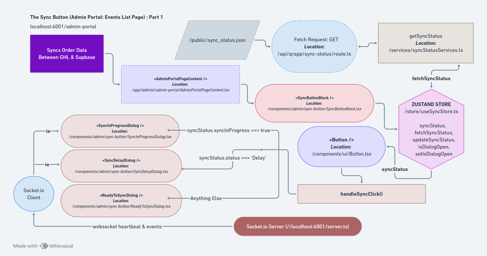
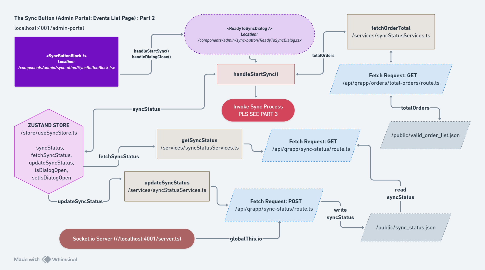
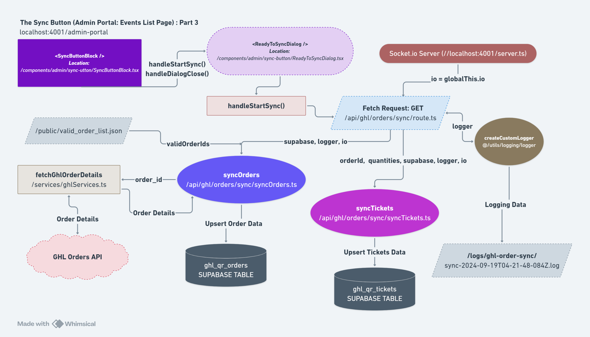

# Data Synchronization

This document describes the data synchronization system in QR Project V3, including automatic webhook-triggered sync, manual sync with real-time progress, and sync status monitoring.

---

## Overview

The Data Synchronization feature keeps order and ticket data in sync between GoHighLevel CRM and Supabase database. It supports both automatic (webhook-triggered) and manual synchronization with real-time progress updates via Socket.IO.

### Key Features

- **Automatic Sync** - Webhook-triggered sync on order creation
- **Manual Sync** - Admin-initiated full database sync
- **Real-time Progress** - Socket.IO updates during sync
- **Incremental Sync** - Only valid orders are synchronized
- **Ticket Generation** - Automatic ticket creation based on quantities
- **Error Recovery** - Robust error handling and logging

---

## Synchronization Architecture

```
┌─────────────────┐
│  GoHighLevel    │
│     Orders      │
└────────┬────────┘
         │
         ├─── Webhook (Automatic) ────┐
         │                            │
         └─── Manual Trigger ─────┐   │
                                  │   │
                            ┌─────▼───▼─────┐
                            │  Sync Process │
                            │  (Socket.IO)  │
                            └───────┬───────┘
                                    │
                        ┌───────────┴──────────┐
                        │                      │
                  ┌─────▼──────┐      ┌───────▼────────┐
                  │  Supabase  │      │  JSON Status   │
                  │  Database  │      │     Files      │
                  └────────────┘      └────────────────┘
```





---

## Automatic Synchronization

### Webhook-Triggered Sync

When a new order is created in GHL, the webhook automatically syncs it:

**File Location:** `app/api/ghl/webhook-qr/route.ts:59`

```typescript
// Step 4: Asynchronously sync the order
fetch(
  `${process.env.NEXT_PUBLIC_API_BASE_URL}/api/ghl/orders/${extractedData.order_id}`,
  { method: "GET" }
)
  .then((response) => response.json())
  .then((orderSyncResult) => {
    console.log(`Order ${extractedData.order_id} synced successfully`);
  })
  .catch((error) => {
    console.error(`Failed to sync order ${extractedData.order_id}:`, error.message);
  });
```

### Single Order Sync

**API Endpoint:** `GET /api/ghl/orders/[id]`

**File Location:** `app/api/ghl/orders/[id]/route.ts`

**Process:**
1. Fetch order details from GHL API
2. Transform data to Supabase schema
3. Upsert order to `ghl_qr_orders`
4. Generate tickets based on `ticket_quantities`

---

## Manual Synchronization

### Full Database Sync

**API Endpoint:** `GET /api/ghl/orders/sync`

**File Location:** `app/api/ghl/orders/sync/route.ts:11`

### Sync Process Flow

```
1. Load valid order list (public/valid_order_list.json)
    ↓
2. Emit initial sync status via Socket.IO
    ↓
3. For each valid order:
    a. Fetch order details from GHL
    b. Upsert to ghl_qr_orders
    c. Extract ticket_quantities
    d. Emit progress update
    ↓
4. For each order's tickets:
    a. Generate tickets in ghl_qr_tickets
    b. Emit ticket progress
    ↓
5. Emit final sync status
    ↓
6. Save sync status to public/sync_status.json
```

### Implementation

```typescript
// app/api/ghl/orders/sync/route.ts
import { NextResponse } from "next/server";
import { createClient } from "@/utils/supabase/server";
import { syncOrders } from "./syncOrders";
import { syncTickets } from "./syncTickets";
import { createCustomLogger } from "@/utils/logging/logger";
import fs from "fs";
import path from "path";

export async function GET() {
  const logger = createCustomLogger("ghl-order-sync", "sync");
  const io = globalThis.io;  // Socket.IO instance

  try {
    const supabase = createClient();
    const startTimeMs = Date.now();
    let totalOrdersSynced = 0;
    let totalTicketsAdded = 0;

    // Fetch valid order list
    const validOrderListPath = path.join(
      process.cwd(),
      "public",
      "valid_order_list.json"
    );
    const validOrderIds = JSON.parse(
      fs.readFileSync(validOrderListPath, "utf-8")
    );
    const totalOrders = validOrderIds.length;

    // Emit initial status
    const initialStatus = {
      syncInProgress: true,
      startTime: new Date().toISOString(),
      endTime: null,
      totalOrders: totalOrders,
      syncedOrders: 0,
      status: "Syncing",
      delay_in_sec: 0,
    };
    if (io) {
      io.emit("sync_status", initialStatus);
    }

    // Sync orders
    const { ticketQuantitiesArray } = await syncOrders(supabase, logger, io);
    totalOrdersSynced = ticketQuantitiesArray.length;

    // Sync tickets
    for (let i = 0; i < totalOrdersSynced; i++) {
      const { orderId, quantities } = ticketQuantitiesArray[i];
      const ticketsAdded = await syncTickets(
        orderId,
        quantities,
        supabase,
        logger,
        io
      );
      totalTicketsAdded += ticketsAdded;

      // Emit progress
      if (io) {
        io.emit("sync_progress", {
          syncInProgress: true,
          totalOrders: totalOrders,
          syncedOrders: i + 1,
          totalTickets: totalTicketsAdded,
          status: "Syncing Orders",
        });
      }
    }

    // Emit final status
    const finalStatus = {
      syncInProgress: false,
      startTime: initialStatus.startTime,
      endTime: new Date().toISOString(),
      totalOrders: totalOrders,
      syncedOrders: totalOrders,
      status: "Delay",
      delay_in_sec: 30,
    };

    if (io) {
      io.emit("sync_status", finalStatus);
      io.emit("sync_complete", { message: "Sync Process Complete!" });
    }

    const totalTimeMs = Date.now() - startTimeMs;
    logger.info(`SYNC SUCCESSFUL! Orders: ${totalOrdersSynced}, Tickets: ${totalTicketsAdded}, Time: ${totalTimeMs}ms`);

    return NextResponse.json({
      message: "Orders and tickets synced successfully",
    });
  } catch (error: any) {
    logger.error(`[Error during sync: ${error.message}]`);

    if (io) {
      io.emit("sync_status", {
        syncInProgress: false,
        status: "Error",
      });
    }

    return NextResponse.json({ error: error.message }, { status: 500 });
  }
}
```

---

## Order Synchronization

### syncOrders Function

**File Location:** `app/api/ghl/orders/sync/syncOrders.ts`

```typescript
export async function syncOrders(
  supabase: SupabaseClient,
  logger: Logger,
  io: Server
) {
  const ticketQuantitiesArray: Array<{
    orderId: string;
    quantities: Record<string, number>;
  }> = [];

  // Read valid order list
  const validOrderIds = JSON.parse(
    fs.readFileSync("public/valid_order_list.json", "utf-8")
  );

  for (const orderId of validOrderIds) {
    try {
      // Fetch order details from GHL
      const orderDetails = await fetchGhlOrderDetails(orderId);

      // Transform and upsert to Supabase
      const transformedOrder = transformOrderData(orderDetails);

      const { error } = await supabase
        .from("ghl_qr_orders")
        .upsert(transformedOrder, { onConflict: "order_id" });

      if (error) {
        logger.error(`Failed to sync order ${orderId}: ${error.message}`);
        continue;
      }

      // Store ticket quantities for later ticket generation
      ticketQuantitiesArray.push({
        orderId,
        quantities: transformedOrder.ticket_quantities,
      });

      logger.info(`Order ${orderId} synced successfully`);
    } catch (error: any) {
      logger.error(`Error syncing order ${orderId}: ${error.message}`);
    }
  }

  return { ticketQuantitiesArray };
}
```

---

## Ticket Synchronization

### syncTickets Function

**File Location:** `app/api/ghl/orders/sync/syncTickets.ts`

```typescript
export async function syncTickets(
  orderId: string,
  quantities: Record<string, number>,
  supabase: SupabaseClient,
  logger: Logger,
  io: Server
): Promise<number> {
  let ticketsAdded = 0;

  // Delete existing tickets for this order
  await supabase
    .from("ghl_qr_tickets")
    .delete()
    .eq("order_id", orderId);

  // Generate new tickets based on quantities
  for (const [ticketType, qty] of Object.entries(quantities)) {
    for (let i = 0; i < qty; i++) {
      const { error } = await supabase
        .from("ghl_qr_tickets")
        .insert({
          order_id: orderId,
          ticket_type: ticketType,
          status: "live",
        });

      if (!error) {
        ticketsAdded++;
      } else {
        logger.error(`Failed to create ticket: ${error.message}`);
      }
    }
  }

  logger.info(`Added ${ticketsAdded} tickets for order ${orderId}`);
  return ticketsAdded;
}
```

**Example:**
```
Order: order_abc123
ticket_quantities: { "VIP": 2, "Regular": 3 }

Tickets Created:
- ticket_id: 1, order_id: order_abc123, ticket_type: VIP, status: live
- ticket_id: 2, order_id: order_abc123, ticket_type: VIP, status: live
- ticket_id: 3, order_id: order_abc123, ticket_type: Regular, status: live
- ticket_id: 4, order_id: order_abc123, ticket_type: Regular, status: live
- ticket_id: 5, order_id: order_abc123, ticket_type: Regular, status: live
```

---

## Real-Time Progress Updates

### Socket.IO Integration

**Server Setup:**
```typescript
// server.js
import { Server } from "socket.io";

const io = new Server(server);
globalThis.io = io;  // Make Socket.IO globally accessible

io.on("connection", (socket) => {
  console.log("Client connected:", socket.id);

  socket.on("disconnect", () => {
    console.log("Client disconnected:", socket.id);
  });
});
```

### Socket.IO Events

| Event | Payload | Description |
|-------|---------|-------------|
| `sync_status` | `SyncStatus` | Initial and final sync status |
| `sync_progress` | `ProgressUpdate` | Incremental progress during sync |
| `sync_ticket_progress` | `TicketProgress` | Ticket verification phase |
| `sync_complete` | `{ message: string }` | Sync completion notification |

### Event Payloads

```typescript
interface SyncStatus {
  syncInProgress: boolean;
  startTime: string | null;
  endTime: string | null;
  totalOrders: number;
  syncedOrders: number;
  status: "Syncing" | "Delay" | "Completed" | "Error";
  delay_in_sec: number;
}

interface ProgressUpdate {
  syncInProgress: boolean;
  totalOrders: number;
  syncedOrders: number;
  totalTickets: number;
  status: string;
}

interface TicketProgress {
  totalTicketsChecked: number;
  totalTicketTypes: number;
  status: string;
}
```

---

## Frontend Sync Monitoring

### React Component

```typescript
"use client";

import { useEffect, useState } from "react";
import { io, Socket } from "socket.io-client";

export default function SyncMonitor() {
  const [syncStatus, setSyncStatus] = useState<any>(null);
  const [progress, setProgress] = useState<any>(null);
  const [socket, setSocket] = useState<Socket | null>(null);

  useEffect(() => {
    // Connect to Socket.IO
    const socketInstance = io();
    setSocket(socketInstance);

    // Listen for sync status
    socketInstance.on("sync_status", (status) => {
      console.log("Sync status:", status);
      setSyncStatus(status);
    });

    // Listen for progress updates
    socketInstance.on("sync_progress", (progressData) => {
      console.log("Sync progress:", progressData);
      setProgress(progressData);
    });

    // Listen for sync completion
    socketInstance.on("sync_complete", (data) => {
      console.log("Sync complete:", data);
      alert("Sync completed successfully!");
    });

    // Cleanup on unmount
    return () => {
      socketInstance.disconnect();
    };
  }, []);

  const triggerSync = async () => {
    const response = await fetch("/api/ghl/orders/sync");
    const result = await response.json();
    console.log("Sync triggered:", result);
  };

  return (
    <div>
      <h1>Data Synchronization</h1>

      <button onClick={triggerSync}>
        Start Manual Sync
      </button>

      {syncStatus && (
        <div>
          <h2>Sync Status</h2>
          <p>Status: {syncStatus.status}</p>
          <p>In Progress: {syncStatus.syncInProgress ? "Yes" : "No"}</p>
          <p>Total Orders: {syncStatus.totalOrders}</p>
          <p>Synced Orders: {syncStatus.syncedOrders}</p>
        </div>
      )}

      {progress && (
        <div>
          <h2>Progress</h2>
          <p>Orders: {progress.syncedOrders} / {progress.totalOrders}</p>
          <p>Tickets: {progress.totalTickets}</p>
          <progress
            value={progress.syncedOrders}
            max={progress.totalOrders}
          />
        </div>
      )}
    </div>
  );
}
```

---

## Sync Status Persistence

Sync status is saved to a JSON file for persistence:

**File Location:** `public/sync_status.json`

```json
{
  "syncInProgress": false,
  "startTime": "2025-12-31T10:00:00.000Z",
  "endTime": "2025-12-31T10:05:00.000Z",
  "totalOrders": 150,
  "syncedOrders": 150,
  "status": "Completed",
  "delay_in_sec": 0
}
```

### Reading Sync Status

**API Endpoint:** `GET /api/qrapp/sync-status`

```typescript
export async function GET() {
  const filePath = path.join(process.cwd(), "public", "sync_status.json");

  try {
    const fileContent = fs.readFileSync(filePath, "utf-8");
    const syncStatus = JSON.parse(fileContent);

    return NextResponse.json(syncStatus, { status: 200 });
  } catch (error: any) {
    return NextResponse.json({ error: error.message }, { status: 500 });
  }
}
```

---

## Valid Order Filtering

Before syncing, the system generates a list of valid orders (orders with active products):

**API Endpoint:** `POST /api/ghl/orders`

**Process:**
1. Fetch all product IDs from GHL
2. Fetch all order IDs from GHL
3. For each order, check if product is valid
4. Save valid order IDs to `public/valid_order_list.json`

**Generated File:**
```json
// public/valid_order_list.json
[
  "order_abc123",
  "order_def456",
  "order_ghi789"
]
```

---

## Sync Performance

### Timing Example

```
Total Orders: 150
Total Time: 5 minutes 30 seconds
Average: 2.2 seconds per order
Tickets Generated: 450
```

### Optimization Strategies

1. **Batch Processing** - Process multiple orders in parallel
2. **Caching** - Cache GHL API responses
3. **Incremental Sync** - Only sync changed orders
4. **Index Optimization** - Ensure database indexes are present

---

## Error Handling

### Common Sync Errors

| Error | Cause | Solution |
|-------|-------|----------|
| `No valid products found` | No active products in GHL | Create products in GHL |
| `Failed to fetch order details` | GHL API connection issue | Check GHL_ACCESS_TOKEN |
| `Database connection error` | Supabase connection issue | Verify Supabase credentials |
| `Socket.IO not initialized` | Server not started | Ensure custom Express server is running |

### Error Logging

```typescript
logger.error(`Sync failed: ${error.message}`, {
  orderId,
  timestamp: new Date().toISOString(),
  stack: error.stack,
});
```

---

## Related Documentation

- [Event Ticketing](/docs/features/event-ticketing.md) - Order and event management
- [GHL Integration](/docs/api/ghl-integration.md) - GHL API endpoints
- [Data Flow](/docs/architecture/data-flow.md) - Complete sync architecture
- [Webhook Integration](/docs/api/webhook-integration.md) - Automatic sync via webhook

---

**Last Updated:** December 31, 2025
