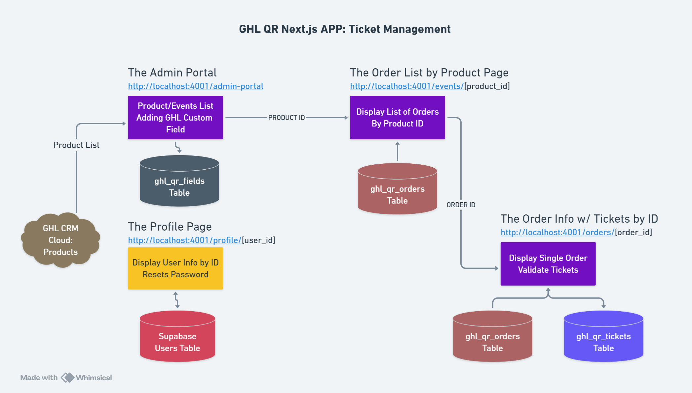

# Event Ticketing

This document describes the event ticketing system in QR Project V3, including event management, ticket creation, pricing structures, and the integration with GoHighLevel CRM.

---

## Overview

The Event Ticketing feature enables administrators to manage events (products) from GoHighLevel, process ticket orders, and generate unique QR codes for each order. The system supports multiple ticket types per event and dynamic pricing.

### Key Features

- **Event Synchronization** - Automatic sync of events/products from GHL
- **Multiple Ticket Types** - Support for VIP, Regular, Early Bird, etc.
- **Dynamic Pricing** - Ticket prices fetched from GHL API
- **Order Management** - Complete order tracking with pagination
- **QR Code Generation** - Automatic QR code creation for each order
- **Real-time Updates** - WebSocket-based sync progress monitoring

---

## Architecture

```
GoHighLevel CRM
    ↓
Events (Products) API
    ↓
/api/ghl/events → Fetch Product IDs
    ↓
/api/ghl/price → Fetch Pricing Data
    ↓
Supabase (ghl_qr_orders)
    ↓
Admin Portal → Event List & Management
```



---

## Event Data Structure

### GHL Event (Product) Schema

```typescript
interface GHLEvent {
  _id: string;                    // Product/Event ID
  name: string;                   // Event name
  image?: string;                 // Event image URL
  locationId: string;             // GHL location ID
  prices: Array<{
    _id: string;                  // Price variant ID
    name: string;                 // Ticket type (VIP, Regular, etc.)
    amount: number;               // Price in cents
    currency: string;             // Currency code (USD, EUR, etc.)
  }>;
  availableQuantity?: number;     // Total available tickets
  createdAt: string;              // Creation timestamp
}
```

### Database Event Schema

Events are stored indirectly through orders in the `ghl_qr_orders` table:

```sql
-- Event data embedded in orders
SELECT DISTINCT
  event_id,
  event_name,
  event_image,
  event_ticket_price,
  event_ticket_currency,
  event_available_qty
FROM ghl_qr_orders;
```

**TypeScript Interface:**
```typescript
interface Event {
  event_id: string;
  event_name: string;
  event_image: string | null;
  event_ticket_price: number | null;
  event_ticket_currency: string | null;
  event_available_qty: number | null;
}
```

---

## Fetching Events from GHL

### 1. Get All Event IDs

**API Endpoint:** `GET /api/ghl/events`

**File Location:** `app/api/ghl/events/route.ts:53`

**Implementation:**
```typescript
// Fetch all product/event IDs from GHL
async function fetchProductIds(locationId: string) {
  const apiUrl = `https://services.leadconnectorhq.com/products/?locationId=${locationId}`;

  const response = await fetch(apiUrl, {
    method: "GET",
    headers: {
      "Content-Type": "application/json",
      Authorization: `Bearer ${process.env.GHL_ACCESS_TOKEN}`,
      Version: "2021-07-28",
    },
  });

  const data = await response.json();
  return data.products.map((product: { _id: string }) => product._id);
}

export async function GET() {
  const locationId = process.env.NEXT_PUBLIC_GHL_LOCATION_ID;
  const productIds = await fetchProductIds(locationId);
  return NextResponse.json({ productIds }, { status: 200 });
}
```

**Response:**
```json
{
  "productIds": [
    "event_abc123",
    "event_def456",
    "event_ghi789"
  ]
}
```

---

### 2. Get Event Pricing

**API Endpoint:** `GET /api/ghl/price?product_id={productId}&location_id={locationId}`

**File Location:** `app/api/ghl/price/route.ts`

**Request:**
```
GET /api/ghl/price?product_id=event_abc123&location_id=location_123
```

**Response:**
```json
{
  "prices": [
    {
      "_id": "price_vip",
      "name": "VIP",
      "amount": 10000,
      "currency": "USD"
    },
    {
      "_id": "price_regular",
      "name": "Regular",
      "amount": 5000,
      "currency": "USD"
    }
  ]
}
```

---

## Ticket Types Generation

The system generates a JSON file mapping ticket types to each event:

**File Location:** `utils/qrapp/helpers.ts:78`

```typescript
export async function generateTicketTypesJson(
  productIds: string[],
  locationId: string
): Promise<Array<{ product_id: string; ticket_types: Array<{ name: string }> }>> {
  const ticketTypesArray: Array<{
    product_id: string;
    ticket_types: Array<{ name: string }>;
  }> = [];

  for (const productId of productIds) {
    try {
      const prices = await fetchPrices(productId, locationId);
      ticketTypesArray.push({
        product_id: productId,
        ticket_types: prices.map((price: { name: string }) => ({
          name: price.name,
        })),
      });
    } catch (error) {
      console.error(`Failed to fetch prices for product: ${productId}`, error);
    }
  }

  return ticketTypesArray;
}
```

**Generated File:**
```json
// public/ticket_types.json
[
  {
    "product_id": "event_abc123",
    "ticket_types": [
      { "name": "VIP" },
      { "name": "Regular" },
      { "name": "Early Bird" }
    ]
  }
]
```

---

## Order Processing Flow

```
1. Customer places order in GHL
    ↓
2. GHL triggers webhook → /api/ghl/webhook-qr
    ↓
3. Extract order data (product_id, contact_id, order_id)
    ↓
4. Generate QR code for order
    ↓
5. Update GHL contact custom field with QR code
    ↓
6. Sync order to Supabase → ghl_qr_orders
    ↓
7. Generate tickets based on ticket_quantities
    ↓
8. Insert tickets into ghl_qr_tickets
```

---

## Order Data Structure

### GHL Order Schema

```typescript
interface GHLOrder {
  _id: string;                    // Order ID
  contactId: string;              // Customer contact ID
  locationId: string;             // GHL location ID
  items: Array<{
    product: {
      _id: string;                // Event/Product ID
      name: string;               // Event name
      image?: string;             // Event image
    };
    price: {
      _id: string;                // Price variant ID
      name: string;               // Ticket type name
      amount: number;             // Price in cents
      currency: string;           // Currency code
    };
    qty: number;                  // Quantity ordered
  }>;
  amount: {
    total: number;                // Total amount paid
    currency: string;             // Currency
  };
  status: string;                 // Order status (completed, pending, etc.)
  fulfillmentStatus: string;      // Fulfillment status
  createdAt: string;              // Order creation timestamp
}
```

### Supabase Order Schema

```typescript
interface Order {
  order_id: string;
  location_id: string | null;
  total_paid: number | null;
  payment_status: string | null;
  payment_currency: string | null;
  order_status: string | null;
  contact_id: string | null;
  contact_firstname: string | null;
  contact_lastname: string | null;
  contact_email: string | null;
  contact_phone: string | null;
  date_added: string | null;
  event_id: string | null;
  event_name: string | null;
  event_image: string | null;
  event_ticket_price: number | null;
  event_ticket_currency: string | null;
  event_available_qty: number | null;
  event_ticket_qty: number | null;
  event_ticket_type: string | null;
  qr_code_image: string | null;
  ticket_quantities: Record<string, number> | null;  // JSONB
  inserted_at: string;
  updated_at: string;
}
```

---

## Ticket Quantities (JSONB)

Orders support multiple ticket types via the `ticket_quantities` JSONB field:

```json
{
  "VIP": 2,
  "Regular": 5,
  "Early Bird": 1
}
```

### Querying Ticket Quantities

```sql
-- Get all orders with VIP tickets
SELECT * FROM ghl_qr_orders
WHERE ticket_quantities ? 'VIP';

-- Get VIP ticket count for each order
SELECT
  order_id,
  (ticket_quantities->>'VIP')::int as vip_count
FROM ghl_qr_orders
WHERE ticket_quantities->>'VIP' IS NOT NULL;

-- Get total tickets for an order
SELECT
  order_id,
  jsonb_object_keys(ticket_quantities) as ticket_type,
  (ticket_quantities->>jsonb_object_keys(ticket_quantities))::int as quantity
FROM ghl_qr_orders;
```

---

## Event List in Admin Portal

**Page Location:** `app/(admin)/events/page.tsx`


### Fetching Events

```typescript
"use client";

import { useEffect, useState } from "react";

interface Event {
  event_id: string;
  event_name: string;
  event_image: string;
  event_ticket_price: number;
}

export default function EventsPage() {
  const [events, setEvents] = useState<Event[]>([]);

  useEffect(() => {
    const fetchEvents = async () => {
      const response = await fetch("/api/qrapp/events");
      const { events } = await response.json();
      setEvents(events);
    };

    fetchEvents();
  }, []);

  return (
    <div>
      <h1>Events</h1>
      {events.map((event) => (
        <div key={event.event_id}>
          <h2>{event.event_name}</h2>
          
          <p>Price: ${event.event_ticket_price / 100}</p>
        </div>
      ))}
    </div>
  );
}
```

---

## Event Filtering and Search

### Filter Orders by Event

```typescript
const fetchOrdersByEvent = async (eventId: string) => {
  const response = await fetch(`/api/qrapp/orders?event_id=${eventId}`);
  const { orders } = await response.json();
  return orders;
};
```

### SQL Query

```sql
SELECT * FROM ghl_qr_orders
WHERE event_id = 'event_abc123'
AND payment_status = 'paid'
ORDER BY date_added DESC;
```

---

## Ticket Generation from Orders

When an order is synced, tickets are automatically generated based on `ticket_quantities`:

**File Location:** `app/api/ghl/orders/sync/syncTickets.ts`

```typescript
async function syncTickets(
  orderId: string,
  quantities: Record<string, number>,
  supabase: SupabaseClient,
  logger: Logger,
  io: Server
) {
  let ticketsAdded = 0;

  for (const [ticketType, qty] of Object.entries(quantities)) {
    for (let i = 0; i < qty; i++) {
      const { error } = await supabase
        .from("ghl_qr_tickets")
        .insert({
          order_id: orderId,
          ticket_type: ticketType,
          status: "live",
        });

      if (!error) {
        ticketsAdded++;
      }
    }
  }

  return ticketsAdded;
}
```

**Example:**
```
Order: order_abc123
ticket_quantities: { "VIP": 2, "Regular": 3 }

Generated Tickets:
- ticket_id: 1, order_id: order_abc123, ticket_type: VIP, status: live
- ticket_id: 2, order_id: order_abc123, ticket_type: VIP, status: live
- ticket_id: 3, order_id: order_abc123, ticket_type: Regular, status: live
- ticket_id: 4, order_id: order_abc123, ticket_type: Regular, status: live
- ticket_id: 5, order_id: order_abc123, ticket_type: Regular, status: live
```

---

## Order Statistics

### Total Orders Count

```typescript
const fetchTotalOrders = async () => {
  const response = await fetch("/api/qrapp/orders/total-orders");
  const { totalOrders } = await response.json();
  return totalOrders;
};
```

### Orders by Payment Status

```sql
SELECT
  payment_status,
  COUNT(*) as count,
  SUM(total_paid) as total_revenue
FROM ghl_qr_orders
GROUP BY payment_status;
```

---

## Event Capacity Management

### Available Quantity Tracking

```sql
-- Check remaining capacity for an event
SELECT
  event_id,
  event_name,
  event_available_qty,
  SUM(event_ticket_qty) as sold_tickets,
  (event_available_qty - SUM(event_ticket_qty)) as remaining
FROM ghl_qr_orders
WHERE event_id = 'event_abc123'
GROUP BY event_id, event_name, event_available_qty;
```

---

## Related Documentation

- [QR Code Generation](/docs/features/qr-code-generation.md) - QR code creation process
- [Data Synchronization](/docs/features/data-synchronization.md) - Order and ticket sync
- [Ticket Validation](/docs/features/ticket-validation.md) - Ticket validation workflow
- [GHL Integration](/docs/api/ghl-integration.md) - GHL API endpoints
- [Database Schema](/docs/database/schema.md) - Complete database structure

---

**Last Updated:** December 31, 2025
