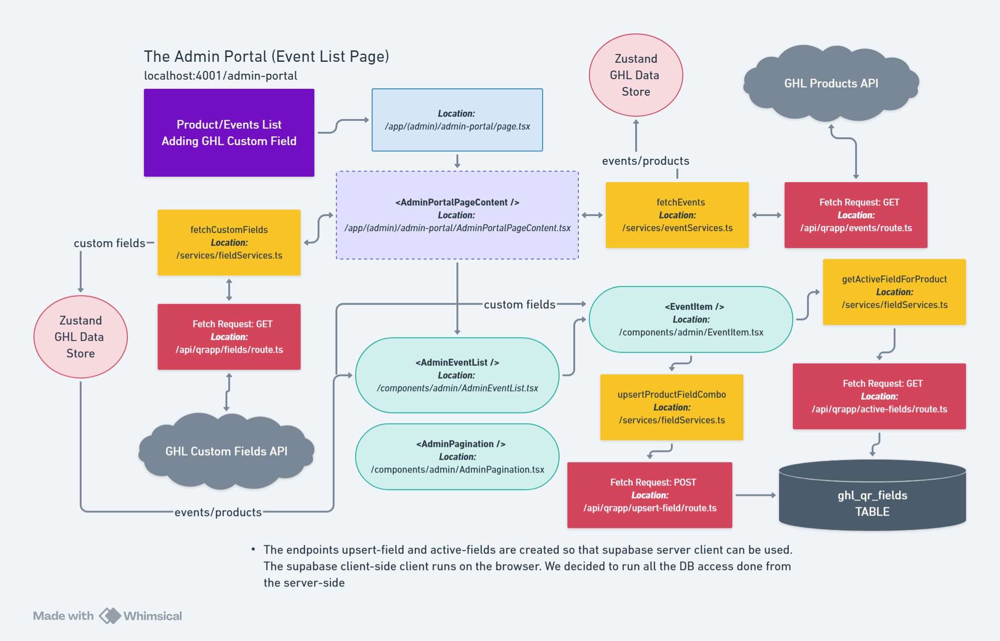
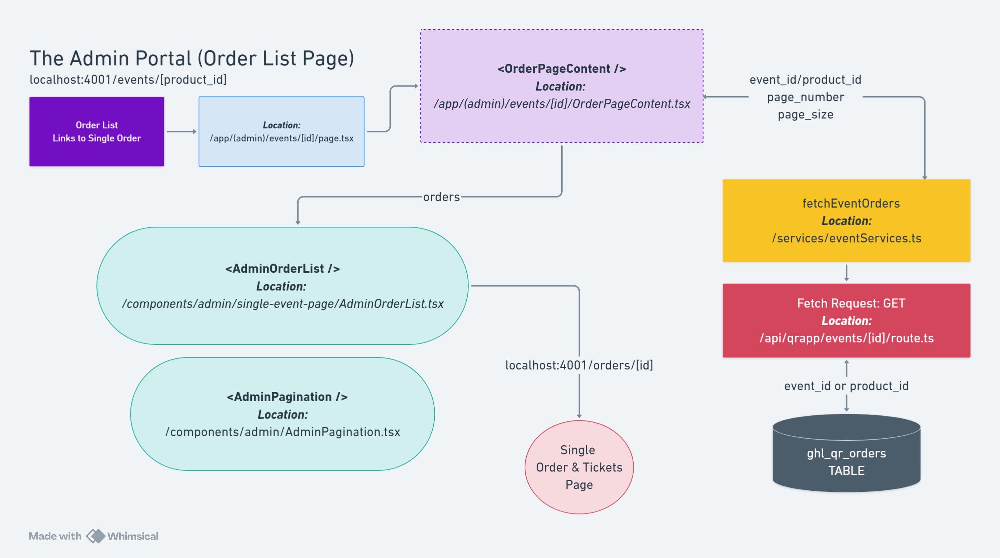
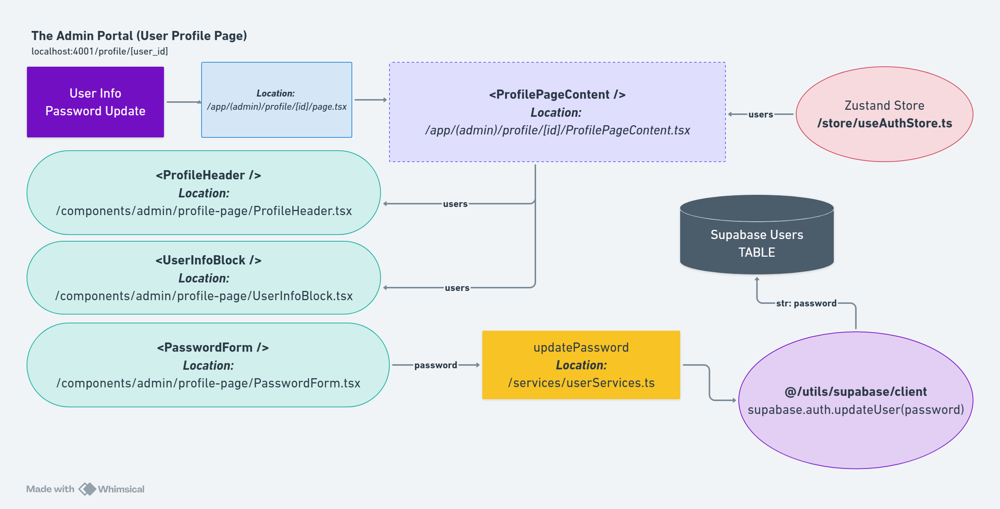

# Admin Workflows

This document describes the step-by-step workflows for Admin and Member users, including login, event management, order management, and ticket validation.

---

## Overview

Admin and Member users have access to the Admin Portal, which provides event ticketing, order tracking, and ticket validation functionality.

### User Roles

- **Admin**: Full access to events, orders, and ticket validation
- **Member**: View-only access (limited write permissions)

### Key Workflows

1. Admin Login
2. Viewing Events
3. Managing Orders
4. Validating Tickets
5. Managing User Profile

---

## Workflow 1: Admin Login

### Step-by-Step Process

```
┌─────────────────────────────────────────────────────────────┐
│                     ADMIN LOGIN FLOW                        │
└─────────────────────────────────────────────────────────────┘

1. User navigates to /admin-login
   ↓
2. User enters email and password
   ↓
3. Form validation (client-side)
   ├─ Invalid → Show error message
   └─ Valid → Continue
   ↓
4. Submit credentials to /api/auth/login
   ↓
5. Server validates credentials
   ├─ Invalid → Return error
   └─ Valid → Continue
   ↓
6. Check user roles (is_qr_admin or is_qr_member)
   ├─ No roles → Redirect to unauthorized
   └─ Has roles → Continue
   ↓
7. Create Supabase session
   ↓
8. Store user in Zustand (useAuthStore)
   ↓
9. Redirect to /admin-portal
   ↓
10. Admin Portal Layout loads
    ↓
11. withRoleCheck HOC verifies permissions
    ├─ Unauthorized → Redirect to /admin-login
    └─ Authorized → Show Admin Portal
```

### Code Example

**File**: `app/(auth)/admin-login/page.tsx`

```typescript
"use client";

import { useState } from "react";
import { useRouter } from "next/navigation";
import { useAuthStore } from "@/store/useAuthStore";
import { Input } from "@/components/ui/input";
import { Button } from "@/components/ui/button";

export default function AdminLoginPage() {
  const router = useRouter();
  const { login } = useAuthStore();
  const [email, setEmail] = useState("");
  const [password, setPassword] = useState("");
  const [error, setError] = useState("");
  const [isLoading, setIsLoading] = useState(false);

  const handleSubmit = async (e: React.FormEvent) => {
    e.preventDefault();
    setIsLoading(true);
    setError("");

    try {
      await login(email, password);
      router.push("/admin-portal");
    } catch (err: any) {
      setError(err.message || "Invalid credentials");
    } finally {
      setIsLoading(false);
    }
  };

  return (
    <form onSubmit={handleSubmit}>
      <Input
        type="email"
        value={email}
        onChange={(e) => setEmail(e.target.value)}
        required
      />
      <Input
        type="password"
        value={password}
        onChange={(e) => setPassword(e.target.value)}
        required
      />
      {error && <p className="text-red-500">{error}</p>}
      <Button type="submit" disabled={isLoading}>
        {isLoading ? "Logging in..." : "Login"}
      </Button>
    </form>
  );
}
```

### Success Criteria

- User successfully authenticated
- Session created in Supabase
- User state stored in Zustand
- Redirected to `/admin-portal`

---

## Workflow 2: Viewing Events

### Step-by-Step Process

```
┌─────────────────────────────────────────────────────────────┐
│                   VIEW EVENTS WORKFLOW                      │
└─────────────────────────────────────────────────────────────┘

1. User navigates to /events
   ↓
2. Page loads (Server Component)
   ↓
3. Fetch events from Supabase
   SELECT DISTINCT event_name,
          SUM(event_ticket_qty) as total_tickets,
          SUM(total_paid) as total_revenue
   FROM ghl_qr_orders
   GROUP BY event_name
   ↓
4. Render event cards in grid layout
   ├─ Event name
   ├─ Total tickets sold
   └─ Total revenue
   ↓
5. User clicks on an event card
   ↓
6. Navigate to /events/[eventName]
   ↓
7. Display orders for selected event
```

### Code Example

**File**: `app/(admin)/events/page.tsx`

```typescript
import { createClient } from "@/utils/supabase/server";
import { Card, CardHeader, CardTitle, CardContent } from "@/components/ui/card";
import Link from "next/link";

export default async function EventsPage() {
  const supabase = createClient();

  const { data: events, error } = await supabase
    .from("ghl_qr_orders")
    .select("event_name, event_ticket_qty, total_paid")
    .order("event_name");

  // Group by event_name
  const groupedEvents = events?.reduce((acc, order) => {
    if (!acc[order.event_name]) {
      acc[order.event_name] = {
        event_name: order.event_name,
        total_tickets: 0,
        total_revenue: 0,
      };
    }
    acc[order.event_name].total_tickets += order.event_ticket_qty;
    acc[order.event_name].total_revenue += order.total_paid;
    return acc;
  }, {});

  const eventList = Object.values(groupedEvents || {});

  return (
    <div className="p-2 sm:p-10">
      <h1 className="text-4xl font-extrabold mb-8">Events List</h1>

      <div className="grid grid-cols-1 md:grid-cols-2 lg:grid-cols-3 gap-6">
        {eventList.map((event) => (
          <Link key={event.event_name} href={`/events/${event.event_name}`}>
            <Card className="hover:shadow-lg transition-shadow cursor-pointer">
              <CardHeader>
                <CardTitle>{event.event_name}</CardTitle>
              </CardHeader>
              <CardContent>
                <p>Tickets Sold: {event.total_tickets}</p>
                <p>Revenue: ${event.total_revenue.toFixed(2)}</p>
              </CardContent>
            </Card>
          </Link>
        ))}
      </div>
    </div>
  );
}
```

### UI Reference



---

## Workflow 3: Managing Orders

### Step-by-Step Process

```
┌─────────────────────────────────────────────────────────────┐
│                  MANAGE ORDERS WORKFLOW                     │
└─────────────────────────────────────────────────────────────┘

1. User navigates to /orders
   ↓
2. Fetch all orders from /api/qrapp/orders
   ↓
3. Display orders in table format
   ├─ Order ID (clickable)
   ├─ Event name
   ├─ Customer email
   ├─ Ticket quantity
   ├─ Total paid
   └─ Payment status
   ↓
4. User enters search term in search bar
   ↓
5. Filter orders client-side by:
   ├─ Order ID
   └─ Contact email
   ↓
6. User clicks on Order ID
   ↓
7. Navigate to /orders/[orderId]
   ↓
8. Display single order details
   ├─ Order information card
   └─ Ticket validation table
```

### Code Example

**File**: `app/(admin)/orders/page.tsx`

```typescript
"use client";

import { useState, useEffect } from "react";
import { Input } from "@/components/ui/input";
import { Table, TableHeader, TableBody, TableRow, TableHead, TableCell } from "@/components/ui/table";
import { Badge } from "@/components/ui/badge";
import Link from "next/link";

export default function OrdersPage() {
  const [orders, setOrders] = useState([]);
  const [searchTerm, setSearchTerm] = useState("");
  const [isLoading, setIsLoading] = useState(true);

  useEffect(() => {
    fetchOrders();
  }, []);

  const fetchOrders = async () => {
    const response = await fetch("/api/qrapp/orders");
    const { orders } = await response.json();
    setOrders(orders);
    setIsLoading(false);
  };

  const filteredOrders = orders.filter((order) =>
    order.order_id.toLowerCase().includes(searchTerm.toLowerCase()) ||
    order.contact_email.toLowerCase().includes(searchTerm.toLowerCase())
  );

  return (
    <div className="p-2 sm:p-10">
      <h1 className="text-4xl font-extrabold mb-8">Orders List</h1>

      {/* Search Bar */}
      <Input
        type="text"
        placeholder="Search by Order ID or Email..."
        value={searchTerm}
        onChange={(e) => setSearchTerm(e.target.value)}
        className="mb-6 max-w-md"
      />

      {/* Orders Table */}
      <Table>
        <TableHeader>
          <TableRow>
            <TableHead>Order ID</TableHead>
            <TableHead>Event</TableHead>
            <TableHead>Email</TableHead>
            <TableHead>Tickets</TableHead>
            <TableHead>Total</TableHead>
            <TableHead>Status</TableHead>
          </TableRow>
        </TableHeader>
        <TableBody>
          {filteredOrders.map((order) => (
            <TableRow key={order.order_id}>
              <TableCell>
                <Link href={`/orders/${order.order_id}`} className="text-blue-600 hover:underline">
                  {order.order_id}
                </Link>
              </TableCell>
              <TableCell>{order.event_name}</TableCell>
              <TableCell>{order.contact_email}</TableCell>
              <TableCell>{order.event_ticket_qty}</TableCell>
              <TableCell>${order.total_paid.toFixed(2)}</TableCell>
              <TableCell>
                <Badge className={order.payment_status === "paid" ? "bg-green-500" : "bg-yellow-500"}>
                  {order.payment_status}
                </Badge>
              </TableCell>
            </TableRow>
          ))}
        </TableBody>
      </Table>
    </div>
  );
}
```

### UI Reference



---

## Workflow 4: Validating Tickets

### Step-by-Step Process

```
┌─────────────────────────────────────────────────────────────┐
│                TICKET VALIDATION WORKFLOW                   │
└─────────────────────────────────────────────────────────────┘

1. User navigates to /orders/[orderId]
   ↓
2. Fetch order details and tickets
   GET /api/qrapp/orders/[orderId]
   GET /api/qrapp/tickets?orderId=[orderId]
   ↓
3. Display order information card
   ├─ Event name
   ├─ Order ID
   ├─ Contact email
   ├─ Total tickets
   ├─ Total paid
   └─ Payment status
   ↓
4. Display ticket validation table
   ├─ Checkbox column
   ├─ Ticket ID
   ├─ Ticket type
   ├─ Status (live/validated)
   └─ Validated timestamp
   ↓
5. User selects tickets via checkboxes
   ↓
6. Bulk action bar appears
   ├─ Shows count: "X ticket(s) selected"
   └─ "Validate Selected" button
   ↓
7. User clicks "Validate Selected"
   ↓
8. Confirmation dialog opens
   ├─ "Are you sure?"
   ├─ Cancel button
   └─ Confirm button
   ↓
9. User confirms validation
   ↓
10. POST /api/qrapp/tickets/validate-bulk
    Body: { ticketIds: ["ticket_1", "ticket_2"] }
    ↓
11. Server updates ticket status
    UPDATE ghl_qr_tickets
    SET status = 'validated',
        validated_at = NOW()
    WHERE ticket_id IN (...)
    ↓
12. Close dialog, clear selection
    ↓
13. Refresh ticket table
    ↓
14. Show updated ticket statuses
```

### Code Example

**File**: `components/admin/single-order-page/TicketTable.tsx`

```typescript
"use client";

import { useState, useEffect } from "react";
import { Table, TableHeader, TableBody, TableRow, TableHead, TableCell } from "@/components/ui/table";
import { Button } from "@/components/ui/button";
import { Badge } from "@/components/ui/badge";
import { Dialog, DialogContent, DialogHeader, DialogFooter, DialogTitle } from "@/components/ui/dialog";

export default function TicketTable({ orderId }: { orderId: string }) {
  const [tickets, setTickets] = useState([]);
  const [selectedTickets, setSelectedTickets] = useState<string[]>([]);
  const [isDialogOpen, setIsDialogOpen] = useState(false);

  useEffect(() => {
    fetchTickets();
  }, [orderId]);

  const fetchTickets = async () => {
    const response = await fetch(`/api/qrapp/tickets?orderId=${orderId}`);
    const { tickets } = await response.json();
    setTickets(tickets);
  };

  const toggleTicketSelection = (ticketId: string) => {
    setSelectedTickets((prev) =>
      prev.includes(ticketId)
        ? prev.filter((id) => id !== ticketId)
        : [...prev, ticketId]
    );
  };

  const handleValidateSelected = async () => {
    await fetch("/api/qrapp/tickets/validate-bulk", {
      method: "POST",
      headers: { "Content-Type": "application/json" },
      body: JSON.stringify({ ticketIds: selectedTickets }),
    });

    setIsDialogOpen(false);
    setSelectedTickets([]);
    fetchTickets();
  };

  return (
    <div>
      {/* Bulk Action Bar */}
      {selectedTickets.length > 0 && (
        <div className="mb-4 flex justify-between items-center bg-slate-100 p-4 rounded">
          <p className="font-semibold">{selectedTickets.length} ticket(s) selected</p>
          <Button onClick={() => setIsDialogOpen(true)}>Validate Selected</Button>
        </div>
      )}

      {/* Tickets Table */}
      <Table>
        <TableHeader>
          <TableRow>
            <TableHead>Select</TableHead>
            <TableHead>Ticket ID</TableHead>
            <TableHead>Type</TableHead>
            <TableHead>Status</TableHead>
            <TableHead>Validated At</TableHead>
          </TableRow>
        </TableHeader>
        <TableBody>
          {tickets.map((ticket) => (
            <TableRow key={ticket.ticket_id}>
              <TableCell>
                <input
                  type="checkbox"
                  checked={selectedTickets.includes(ticket.ticket_id)}
                  onChange={() => toggleTicketSelection(ticket.ticket_id)}
                  disabled={ticket.status === "validated"}
                />
              </TableCell>
              <TableCell>{ticket.ticket_id}</TableCell>
              <TableCell>{ticket.ticket_type}</TableCell>
              <TableCell>
                <Badge className={ticket.status === "live" ? "bg-green-500" : "bg-red-500"}>
                  {ticket.status}
                </Badge>
              </TableCell>
              <TableCell>
                {ticket.validated_at ? new Date(ticket.validated_at).toLocaleString() : "-"}
              </TableCell>
            </TableRow>
          ))}
        </TableBody>
      </Table>

      {/* Confirmation Dialog */}
      <Dialog open={isDialogOpen} onOpenChange={setIsDialogOpen}>
        <DialogContent className="bg-white">
          <DialogHeader>
            <h3 className="text-lg font-bold">Confirm Validation</h3>
          </DialogHeader>
          <DialogTitle>
            <h1 className="text-red-500">
              Are you sure you want to validate {selectedTickets.length} ticket(s)?
            </h1>
          </DialogTitle>
          <DialogFooter className="space-x-3">
            <Button variant="secondary" onClick={() => setIsDialogOpen(false)}>
              Cancel
            </Button>
            <Button variant="destructive" onClick={handleValidateSelected}>
              Confirm
            </Button>
          </DialogFooter>
        </DialogContent>
      </Dialog>
    </div>
  );
}
```

---

## Workflow 5: Viewing User Profile

### Step-by-Step Process

```
┌─────────────────────────────────────────────────────────────┐
│                 USER PROFILE WORKFLOW                       │
└─────────────────────────────────────────────────────────────┘

1. User navigates to /user-profile
   ↓
2. Load user data from Zustand (useAuthStore)
   ├─ user.email
   ├─ user.id
   ├─ roles.is_qr_admin
   ├─ roles.is_qr_member
   └─ user.created_at
   ↓
3. Display user information card
   ├─ Email
   ├─ User ID
   ├─ Role badges
   └─ Account creation date
   ↓
4. User clicks "Logout" button
   ↓
5. Call useAuthStore.logout()
   ↓
6. Supabase session cleared
   ↓
7. Zustand state reset
   ↓
8. Redirect to /admin-login
```

### Code Example

**File**: `app/(admin)/user-profile/page.tsx`

```typescript
"use client";

import { useAuthStore } from "@/store/useAuthStore";
import { Card, CardHeader, CardTitle, CardContent } from "@/components/ui/card";
import { Badge } from "@/components/ui/badge";
import { Button } from "@/components/ui/button";
import { useRouter } from "next/navigation";

export default function UserProfilePage() {
  const { user, roles, logout } = useAuthStore();
  const router = useRouter();

  const handleLogout = async () => {
    await logout();
    router.push("/admin-login");
  };

  return (
    <div className="p-2 sm:p-10">
      <h1 className="text-4xl font-extrabold mb-8 text-center">User Profile</h1>

      <Card className="max-w-2xl mx-auto">
        <CardHeader>
          <CardTitle>Account Information</CardTitle>
        </CardHeader>
        <CardContent className="space-y-6">
          <div>
            <p className="text-sm text-slate-500">Email</p>
            <p className="font-semibold text-lg">{user?.email}</p>
          </div>

          <div>
            <p className="text-sm text-slate-500">User ID</p>
            <p className="font-medium">{user?.id}</p>
          </div>

          <div>
            <p className="text-sm text-slate-500 mb-2">Roles</p>
            <div className="flex gap-2">
              {roles.is_qr_admin === 1 && (
                <Badge className="bg-blue-500 text-white">Admin</Badge>
              )}
              {roles.is_qr_member === 1 && (
                <Badge className="bg-green-500 text-white">Member</Badge>
              )}
            </div>
          </div>

          <div>
            <p className="text-sm text-slate-500">Account Created</p>
            <p className="font-medium">
              {user?.created_at && new Date(user.created_at).toLocaleDateString()}
            </p>
          </div>

          <div className="pt-4 border-t">
            <Button variant="destructive" onClick={handleLogout} className="w-full">
              Logout
            </Button>
          </div>
        </CardContent>
      </Card>
    </div>
  );
}
```

### UI Reference



---

## Common Patterns

### Protected Route Access

```typescript
// All admin routes wrapped with withRoleCheck HOC
export default withRoleCheck(AdminLayout, {
  allowedRoles: ["is_qr_admin", "is_qr_member"],
  redirectTo: "/admin-login",
});
```

### Data Fetching Pattern

```typescript
// Client-side fetch
useEffect(() => {
  const fetchData = async () => {
    const response = await fetch("/api/qrapp/orders");
    const { orders } = await response.json();
    setOrders(orders);
  };
  fetchData();
}, []);

// Server-side fetch
const supabase = createClient();
const { data, error } = await supabase.from("ghl_qr_orders").select("*");
```

---

## Related Documentation

- [Admin Portal UI](/docs/ui-components/admin-portal.md) - Admin portal components
- [Authentication](/docs/architecture/authentication.md) - Auth system
- [Ticket Validation](/docs/features/ticket-validation.md) - Ticket validation feature
- [Data Synchronization](/docs/features/data-synchronization.md) - Data sync

---

**Last Updated:** December 31, 2025
