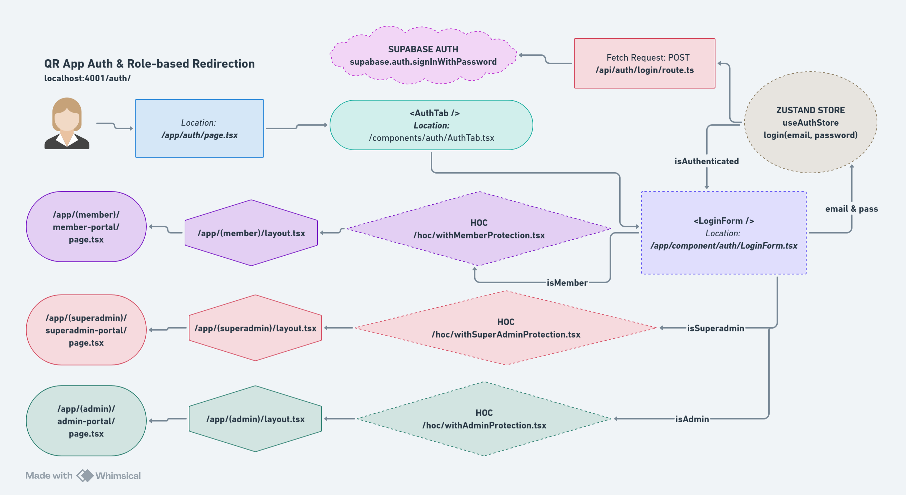
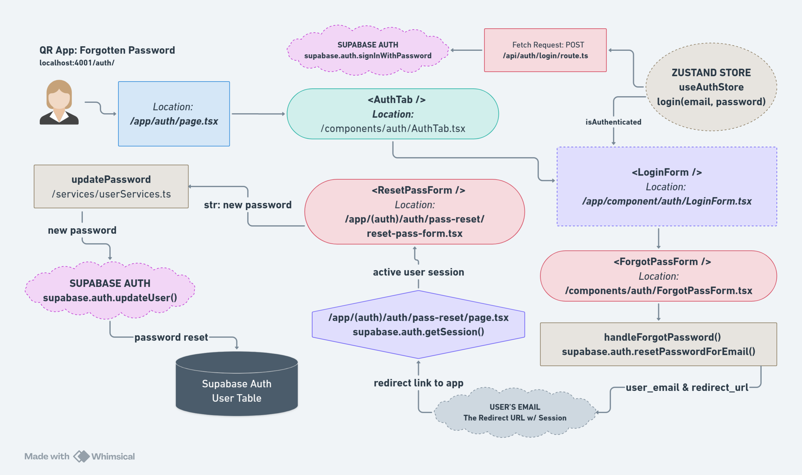

# Authentication Flows

This document describes the authentication workflows used in the QR Project V3, including login, logout, password reset, and session management.

---

## Overview

The application uses **Supabase Auth** for authentication with **Role-Based Access Control (RBAC)** stored in `user_metadata`.

### Authentication System

- **Provider**: Supabase Auth
- **Method**: Email + Password
- **Session**: Server-side cookies (SSR)
- **State Management**: Zustand (useAuthStore)
- **Route Protection**: Higher-Order Components (HOCs)

### User Roles

- **SuperAdmin**: Full system access + user management
- **Admin**: Event, order, and ticket management
- **Member**: View-only access

---

## Authentication Architecture

### Auth Roles Flow Diagram



### Key Components

1. **Supabase Auth**: User authentication and session management
2. **useAuthStore (Zustand)**: Client-side auth state
3. **withRoleCheck HOC**: Route protection at layout level
4. **API Route Protection**: Server-side role verification
5. **user_metadata**: Role storage in Supabase Auth

---

## Workflow 1: Admin Login

### Step-by-Step Process

```
┌─────────────────────────────────────────────────────────────┐
│                      ADMIN LOGIN FLOW                       │
└─────────────────────────────────────────────────────────────┘

1. User navigates to /admin-login
   ↓
2. LoginForm renders
   ├─ Email input field
   ├─ Password input field
   └─ Submit button
   ↓
3. User enters credentials and submits
   ↓
4. Client-side validation
   ├─ Email format check
   └─ Required fields check
   ↓
5. Call useAuthStore.login(email, password)
   ↓
6. POST /api/auth/login
   Body: { email, password }
   ↓
7. Server validates credentials with Supabase
   const { data, error } = await supabase.auth.signInWithPassword({
     email,
     password
   })
   ↓
8. Check for authentication error
   ├─ Error → Return 401 with error message
   └─ Success → Continue
   ↓
9. Extract user_metadata (roles)
   const roles = {
     is_qr_superadmin: user.user_metadata.is_qr_superadmin || 0,
     is_qr_admin: user.user_metadata.is_qr_admin || 0,
     is_qr_member: user.user_metadata.is_qr_member || 0
   }
   ↓
10. Verify user has Admin or Member role
    if (roles.is_qr_admin !== 1 && roles.is_qr_member !== 1) {
      return 403 "Unauthorized: You do not have Admin or Member access"
    }
    ↓
11. Return success response
    { user, roles, session }
    ↓
12. Client updates Zustand state
    set({
      user,
      roles,
      isAuthenticated: true
    })
    ↓
13. Redirect to /admin-portal
    ↓
14. AdminLayout loads with withRoleCheck HOC
    ↓
15. HOC verifies roles on client
    ├─ No roles → Redirect to /admin-login
    └─ Has roles → Render Admin Portal
```

### Code Example

**API Route**: `app/api/auth/login/route.ts`

```typescript
import { createClient } from "@/utils/supabase/server";
import { NextRequest, NextResponse } from "next/server";

export async function POST(req: NextRequest) {
  const { email, password } = await req.json();
  const supabase = createClient();

  // Authenticate with Supabase
  const { data, error } = await supabase.auth.signInWithPassword({
    email,
    password,
  });

  if (error) {
    return NextResponse.json(
      { error: "Invalid credentials" },
      { status: 401 }
    );
  }

  const { user, session } = data;

  // Extract roles from user_metadata
  const roles = {
    is_qr_superadmin: user.user_metadata.is_qr_superadmin || 0,
    is_qr_admin: user.user_metadata.is_qr_admin || 0,
    is_qr_member: user.user_metadata.is_qr_member || 0,
  };

  // Verify user has appropriate role for admin login
  if (roles.is_qr_admin !== 1 && roles.is_qr_member !== 1) {
    return NextResponse.json(
      { error: "Unauthorized: You do not have Admin or Member access" },
      { status: 403 }
    );
  }

  return NextResponse.json({ user, roles, session });
}
```

**Zustand Store**: `store/useAuthStore.ts`

```typescript
import { create } from "zustand";
import { persist } from "zustand/middleware";

interface AuthState {
  user: any;
  roles: {
    is_qr_superadmin: number;
    is_qr_admin: number;
    is_qr_member: number;
  };
  isAuthenticated: boolean;
  login: (email: string, password: string) => Promise<void>;
  logout: () => Promise<void>;
}

export const useAuthStore = create<AuthState>()(
  persist(
    (set) => ({
      user: null,
      roles: {
        is_qr_superadmin: 0,
        is_qr_admin: 0,
        is_qr_member: 0,
      },
      isAuthenticated: false,

      login: async (email: string, password: string) => {
        const response = await fetch("/api/auth/login", {
          method: "POST",
          headers: { "Content-Type": "application/json" },
          body: JSON.stringify({ email, password }),
        });

        if (!response.ok) {
          const { error } = await response.json();
          throw new Error(error);
        }

        const { user, roles, session } = await response.json();

        set({
          user,
          roles,
          isAuthenticated: true,
        });
      },

      logout: async () => {
        await fetch("/api/auth/logout", { method: "POST" });
        set({
          user: null,
          roles: {
            is_qr_superadmin: 0,
            is_qr_admin: 0,
            is_qr_member: 0,
          },
          isAuthenticated: false,
        });
      },
    }),
    {
      name: "auth-store",
    }
  )
);
```

---

## Workflow 2: SuperAdmin Login

### Step-by-Step Process

```
┌─────────────────────────────────────────────────────────────┐
│                   SUPERADMIN LOGIN FLOW                     │
└─────────────────────────────────────────────────────────────┘

1. User navigates to /superadmin-login
   ↓
2. LoginForm renders (identical to Admin login)
   ↓
3. User enters credentials and submits
   ↓
4. Call useAuthStore.login(email, password)
   ↓
5. POST /api/auth/login
   ↓
6. Server validates credentials with Supabase
   ↓
7. Extract roles from user_metadata
   ↓
8. Verify user has SuperAdmin role
   if (roles.is_qr_superadmin !== 1) {
     return 403 "Unauthorized: You do not have SuperAdmin access"
   }
   ↓
9. Return success response
   ↓
10. Client updates Zustand state
    ↓
11. Redirect to /superadmin-portal
    ↓
12. SuperAdminLayout loads with withRoleCheck HOC
    ↓
13. HOC verifies SuperAdmin role
    ├─ Not SuperAdmin → Redirect to /superadmin-login
    └─ Is SuperAdmin → Render SuperAdmin Portal
```

### Role Verification

**Different login pages check different roles:**

```typescript
// Admin Login - checks for Admin OR Member
if (roles.is_qr_admin !== 1 && roles.is_qr_member !== 1) {
  return NextResponse.json({ error: "Unauthorized" }, { status: 403 });
}

// SuperAdmin Login - checks for SuperAdmin ONLY
if (roles.is_qr_superadmin !== 1) {
  return NextResponse.json({ error: "Unauthorized" }, { status: 403 });
}
```

---

## Workflow 3: Route Protection

### Step-by-Step Process

```
┌─────────────────────────────────────────────────────────────┐
│                   ROUTE PROTECTION FLOW                     │
└─────────────────────────────────────────────────────────────┘

1. User attempts to access protected route (e.g., /admin-portal)
   ↓
2. Layout component wrapped with withRoleCheck HOC
   export default withRoleCheck(AdminLayout, {
     allowedRoles: ["is_qr_admin", "is_qr_member"],
     redirectTo: "/admin-login"
   })
   ↓
3. withRoleCheck executes
   ↓
4. Check if user is authenticated
   const { isAuthenticated, roles } = useAuthStore()
   ├─ Not authenticated → Redirect to login page
   └─ Authenticated → Continue
   ↓
5. Check if user has allowed roles
   const hasRequiredRole = allowedRoles.some(role => roles[role] === 1)
   ├─ No required role → Redirect to login page
   └─ Has role → Render protected component
   ↓
6. Protected layout/page renders
```

### Code Example

**HOC**: `hoc/withRoleCheck.tsx`

```typescript
"use client";

import { useEffect } from "react";
import { useRouter } from "next/navigation";
import { useAuthStore } from "@/store/useAuthStore";

interface WithRoleCheckOptions {
  allowedRoles: string[];
  redirectTo: string;
}

export function withRoleCheck<P extends object>(
  Component: React.ComponentType<P>,
  options: WithRoleCheckOptions
) {
  return function ProtectedComponent(props: P) {
    const router = useRouter();
    const { isAuthenticated, roles } = useAuthStore();

    useEffect(() => {
      // Check if user is authenticated
      if (!isAuthenticated) {
        router.push(options.redirectTo);
        return;
      }

      // Check if user has required role
      const hasRequiredRole = options.allowedRoles.some(
        (role) => roles[role as keyof typeof roles] === 1
      );

      if (!hasRequiredRole) {
        router.push(options.redirectTo);
        return;
      }
    }, [isAuthenticated, roles, router]);

    // Only render if authenticated and authorized
    if (!isAuthenticated) return null;

    const hasRequiredRole = options.allowedRoles.some(
      (role) => roles[role as keyof typeof roles] === 1
    );

    if (!hasRequiredRole) return null;

    return <Component {...props} />;
  };
}
```

**Usage in Layout**:

```typescript
// Admin Layout - allows Admin OR Member
import { withRoleCheck } from "@/hoc/withRoleCheck";

function AdminLayout({ children }: { children: React.ReactNode }) {
  return <div>{children}</div>;
}

export default withRoleCheck(AdminLayout, {
  allowedRoles: ["is_qr_admin", "is_qr_member"],
  redirectTo: "/admin-login",
});

// SuperAdmin Layout - allows SuperAdmin ONLY
export default withRoleCheck(SuperAdminLayout, {
  allowedRoles: ["is_qr_superadmin"],
  redirectTo: "/superadmin-login",
});
```

---

## Workflow 4: Logout

### Step-by-Step Process

```
┌─────────────────────────────────────────────────────────────┐
│                       LOGOUT FLOW                           │
└─────────────────────────────────────────────────────────────┘

1. User clicks "Logout" button
   ↓
2. Call useAuthStore.logout()
   ↓
3. POST /api/auth/logout
   ↓
4. Server signs out user from Supabase
   await supabase.auth.signOut()
   ↓
5. Clear Supabase session cookie
   ↓
6. Return success response
   ↓
7. Client clears Zustand state
   set({
     user: null,
     roles: { is_qr_superadmin: 0, is_qr_admin: 0, is_qr_member: 0 },
     isAuthenticated: false
   })
   ↓
8. Clear localStorage (via persist middleware)
   ↓
9. Redirect to login page
   ├─ Admin → /admin-login
   └─ SuperAdmin → /superadmin-login
```

### Code Example

**API Route**: `app/api/auth/logout/route.ts`

```typescript
import { createClient } from "@/utils/supabase/server";
import { NextRequest, NextResponse } from "next/server";

export async function POST(req: NextRequest) {
  const supabase = createClient();

  const { error } = await supabase.auth.signOut();

  if (error) {
    return NextResponse.json({ error: error.message }, { status: 500 });
  }

  return NextResponse.json({ message: "Logged out successfully" });
}
```

**Component**:

```typescript
"use client";

import { useAuthStore } from "@/store/useAuthStore";
import { useRouter } from "next/navigation";
import { Button } from "@/components/ui/button";

export default function LogoutButton() {
  const { logout } = useAuthStore();
  const router = useRouter();

  const handleLogout = async () => {
    await logout();
    router.push("/admin-login");
  };

  return (
    <Button variant="destructive" onClick={handleLogout}>
      Logout
    </Button>
  );
}
```

---

## Workflow 5: Password Reset

### Step-by-Step Process

```
┌─────────────────────────────────────────────────────────────┐
│                  PASSWORD RESET FLOW                        │
└─────────────────────────────────────────────────────────────┘

1. User clicks "Forgot Password?" link on login page
   ↓
2. Navigate to /forgot-password
   ↓
3. User enters email address
   ↓
4. POST /api/auth/reset-password
   Body: { email }
   ↓
5. Server sends password reset email via Supabase
   await supabase.auth.resetPasswordForEmail(email, {
     redirectTo: `${siteUrl}/reset-password`
   })
   ↓
6. Supabase sends email with reset link
   Link format: /reset-password?token=xxx&type=recovery
   ↓
7. User receives email and clicks reset link
   ↓
8. Navigate to /reset-password with token
   ↓
9. Page renders password reset form
   ├─ New password field
   └─ Confirm password field
   ↓
10. User submits new password
    ↓
11. POST /api/auth/update-password
    Body: { password }
    ↓
12. Server validates token (automatically from session)
    ↓
13. Update password in Supabase
    await supabase.auth.updateUser({ password: newPassword })
    ↓
14. Return success response
    ↓
15. Redirect to login page with success message
```

### UI Reference



### Code Example

**Request Password Reset**: `app/api/auth/reset-password/route.ts`

```typescript
import { createClient } from "@/utils/supabase/server";
import { NextRequest, NextResponse } from "next/server";

export async function POST(req: NextRequest) {
  const { email } = await req.json();
  const supabase = createClient();

  const { error } = await supabase.auth.resetPasswordForEmail(email, {
    redirectTo: `${process.env.NEXT_PUBLIC_SITE_URL}/reset-password`,
  });

  if (error) {
    return NextResponse.json({ error: error.message }, { status: 400 });
  }

  return NextResponse.json({
    message: "Password reset email sent. Please check your inbox.",
  });
}
```

**Update Password**: `app/api/auth/update-password/route.ts`

```typescript
import { createClient } from "@/utils/supabase/server";
import { NextRequest, NextResponse } from "next/server";

export async function POST(req: NextRequest) {
  const { password } = await req.json();
  const supabase = createClient();

  // Token automatically verified via session
  const { error } = await supabase.auth.updateUser({ password });

  if (error) {
    return NextResponse.json({ error: error.message }, { status: 400 });
  }

  return NextResponse.json({ message: "Password updated successfully" });
}
```

---

## Session Management

### Server-Side Sessions

```typescript
// Using Supabase SSR
import { createClient } from "@/utils/supabase/server";

export default async function ProtectedPage() {
  const supabase = createClient();

  const {
    data: { user },
  } = await supabase.auth.getUser();

  if (!user) {
    redirect("/admin-login");
  }

  return <div>Protected content</div>;
}
```

### Client-Side State

```typescript
// Using Zustand with persistence
const { user, isAuthenticated, roles } = useAuthStore();

if (!isAuthenticated) {
  router.push("/admin-login");
  return null;
}
```

---

## API Route Protection

### Server-Side Role Check

```typescript
import { createClient } from "@/utils/supabase/server";
import { NextRequest, NextResponse } from "next/server";

export async function GET(req: NextRequest) {
  const supabase = createClient();

  // Get authenticated user
  const {
    data: { user },
  } = await supabase.auth.getUser();

  if (!user) {
    return NextResponse.json({ error: "Unauthorized" }, { status: 401 });
  }

  // Check role
  const roles = user.user_metadata;
  if (roles.is_qr_superadmin !== 1) {
    return NextResponse.json({ error: "Forbidden" }, { status: 403 });
  }

  // Protected logic
  return NextResponse.json({ data: "Protected data" });
}
```

---

## Security Best Practices

### 1. Password Requirements

```typescript
// Minimum 8 characters
if (password.length < 8) {
  throw new Error("Password must be at least 8 characters long");
}
```

### 2. Role Verification

```typescript
// Always verify roles on both client and server
// Client: withRoleCheck HOC
// Server: API route checks
```

### 3. Session Timeout

```typescript
// Supabase default: 1 hour access token, 7 days refresh token
// Automatic refresh handled by Supabase client
```

### 4. CSRF Protection

```typescript
// Supabase Auth cookies have SameSite=Lax by default
// Protects against CSRF attacks
```

---

## Common Authentication Patterns

### Check Authentication Status

```typescript
const { isAuthenticated } = useAuthStore();

if (!isAuthenticated) {
  router.push("/admin-login");
}
```

### Check Specific Role

```typescript
const { roles } = useAuthStore();

if (roles.is_qr_superadmin === 1) {
  // SuperAdmin-specific logic
}
```

### Conditional UI Rendering

```typescript
const { roles } = useAuthStore();

return (
  <div>
    {roles.is_qr_admin === 1 && <AdminPanel />}
    {roles.is_qr_superadmin === 1 && <SuperAdminPanel />}
  </div>
);
```

---

## Related Documentation

- [Authentication Architecture](/docs/architecture/authentication.md) - Auth system details
- [User Management](/docs/features/user-management.md) - User management feature
- [Admin Workflows](/docs/user-flows/admin-workflows.md) - Admin user flows
- [SuperAdmin Workflows](/docs/user-flows/superadmin-workflows.md) - SuperAdmin user flows

---

**Last Updated:** December 31, 2025
