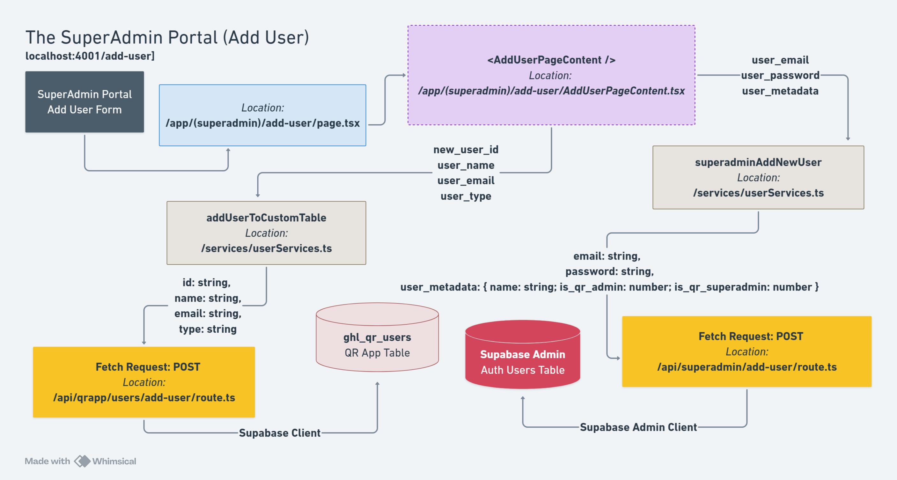
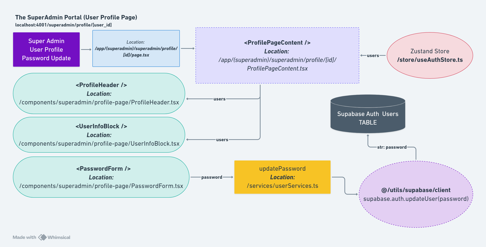

# SuperAdmin Workflows

This document describes the step-by-step workflows for SuperAdmin users, including login, user management, adding users, and deleting users.

---

## Overview

SuperAdmin users have exclusive access to the SuperAdmin Portal, which provides complete user management functionality.

### User Role

- **SuperAdmin**: Full system access with user management capabilities

### Key Workflows

1. SuperAdmin Login
2. Viewing User Dashboard
3. Adding New Users
4. Viewing User Profiles
5. Deleting Users

---

## Workflow 1: SuperAdmin Login

### Step-by-Step Process

```
┌─────────────────────────────────────────────────────────────┐
│                  SUPERADMIN LOGIN FLOW                      │
└─────────────────────────────────────────────────────────────┘

1. User navigates to /superadmin-login
   ↓
2. User enters email and password
   ↓
3. Form validation (client-side)
   ├─ Invalid → Show error message
   └─ Valid → Continue
   ↓
4. Submit credentials to /api/auth/login
   ↓
5. Server validates credentials
   ├─ Invalid → Return error
   └─ Valid → Continue
   ↓
6. Check user roles (is_qr_superadmin)
   ├─ Not SuperAdmin → Redirect to unauthorized
   └─ Is SuperAdmin → Continue
   ↓
7. Create Supabase session
   ↓
8. Store user in Zustand (useAuthStore)
   ↓
9. Redirect to /superadmin-portal
   ↓
10. SuperAdmin Portal Layout loads
    ↓
11. withRoleCheck HOC verifies SuperAdmin permission
    ├─ Unauthorized → Redirect to /superadmin-login
    └─ Authorized → Show SuperAdmin Portal
```

### Code Example

**File**: `app/(auth)/superadmin-login/page.tsx`

```typescript
"use client";

import { useState } from "react";
import { useRouter } from "next/navigation";
import { useAuthStore } from "@/store/useAuthStore";
import { Input } from "@/components/ui/input";
import { Label } from "@/components/ui/label";
import { Button } from "@/components/ui/button";

export default function SuperAdminLoginPage() {
  const router = useRouter();
  const { login } = useAuthStore();
  const [email, setEmail] = useState("");
  const [password, setPassword] = useState("");
  const [error, setError] = useState("");
  const [isLoading, setIsLoading] = useState(false);

  const handleSubmit = async (e: React.FormEvent) => {
    e.preventDefault();
    setIsLoading(true);
    setError("");

    try {
      await login(email, password);
      router.push("/superadmin-portal");
    } catch (err: any) {
      setError(err.message || "Invalid credentials");
    } finally {
      setIsLoading(false);
    }
  };

  return (
    <div className="flex min-h-screen items-center justify-center bg-slate-50">
      <div className="w-full max-w-md p-8 space-y-6 bg-white rounded-lg shadow-md">
        <h1 className="text-3xl font-extrabold text-center">SuperAdmin Login</h1>

        <form onSubmit={handleSubmit} className="space-y-4">
          <div className="space-y-2">
            <Label htmlFor="email">Email</Label>
            <Input
              id="email"
              type="email"
              value={email}
              onChange={(e) => setEmail(e.target.value)}
              required
            />
          </div>

          <div className="space-y-2">
            <Label htmlFor="password">Password</Label>
            <Input
              id="password"
              type="password"
              value={password}
              onChange={(e) => setPassword(e.target.value)}
              required
            />
          </div>

          {error && (
            <div className="bg-red-50 border border-red-200 text-red-700 px-4 py-3 rounded">
              {error}
            </div>
          )}

          <Button type="submit" disabled={isLoading} className="w-full">
            {isLoading ? "Logging in..." : "Login"}
          </Button>
        </form>
      </div>
    </div>
  );
}
```

### Success Criteria

- SuperAdmin successfully authenticated
- Session created in Supabase
- User state stored in Zustand with `is_qr_superadmin: 1`
- Redirected to `/superadmin-portal`

---

## Workflow 2: Viewing User Dashboard

### Step-by-Step Process

```
┌─────────────────────────────────────────────────────────────┐
│               USER DASHBOARD VIEW WORKFLOW                  │
└─────────────────────────────────────────────────────────────┘

1. SuperAdmin navigates to /user-dashboard
   ↓
2. Component mounts, fetch all users
   GET /api/superadmin/get-users
   ↓
3. Server queries Supabase Auth
   const { data: { users } } = await supabase.auth.admin.listUsers()
   ↓
4. For each user, extract:
   ├─ id
   ├─ email
   ├─ is_qr_superadmin (from user_metadata)
   ├─ is_qr_admin (from user_metadata)
   ├─ is_qr_member (from user_metadata)
   └─ created_at
   ↓
5. Return users array to client
   ↓
6. Render users in table
   ├─ Email column
   ├─ Roles column (badges)
   ├─ Created At column
   └─ Actions column
       ├─ View button → /user-dashboard/[userId]
       └─ Delete button (disabled for SuperAdmins)
   ↓
7. SuperAdmin can:
   ├─ Click "Add New User" → /user-dashboard/add-user
   ├─ Click "View" on a user → /user-dashboard/[userId]
   └─ Click "Delete" on non-SuperAdmin users
```

### Code Example

**File**: `app/(superadmin)/user-dashboard/page.tsx`

```typescript
"use client";

import { useState, useEffect } from "react";
import { Table, TableHeader, TableBody, TableRow, TableHead, TableCell } from "@/components/ui/table";
import { Button } from "@/components/ui/button";
import { Badge } from "@/components/ui/badge";
import Link from "next/link";

interface User {
  id: string;
  email: string;
  is_qr_superadmin: number;
  is_qr_admin: number;
  is_qr_member: number;
  created_at: string;
}

export default function UserDashboardPage() {
  const [users, setUsers] = useState<User[]>([]);
  const [isLoading, setIsLoading] = useState(true);

  useEffect(() => {
    fetchUsers();
  }, []);

  const fetchUsers = async () => {
    setIsLoading(true);
    const response = await fetch("/api/superadmin/get-users");
    const { users } = await response.json();
    setUsers(users);
    setIsLoading(false);
  };

  return (
    <div className="p-2 sm:p-10">
      <h1 className="text-4xl font-extrabold mb-8">User Management Dashboard</h1>

      {/* Add User Button */}
      <div className="mb-6 flex justify-end">
        <Link href="/user-dashboard/add-user">
          <Button className="bg-green-600 hover:bg-green-500">
            Add New User
          </Button>
        </Link>
      </div>

      {/* Users Table */}
      {isLoading ? (
        <div className="flex justify-center py-12">
          <div className="animate-spin rounded-full h-12 w-12 border-b-2 border-gray-900"></div>
        </div>
      ) : (
        <Table>
          <TableHeader className="border-b-4 border-red-500">
            <TableRow>
              <TableHead className="font-bold">Email</TableHead>
              <TableHead className="font-bold">Roles</TableHead>
              <TableHead className="font-bold">Created At</TableHead>
              <TableHead className="font-bold text-center">Actions</TableHead>
            </TableRow>
          </TableHeader>
          <TableBody>
            {users.map((user) => (
              <TableRow key={user.id}>
                <TableCell className="font-medium">{user.email}</TableCell>
                <TableCell>
                  <div className="flex gap-2">
                    {user.is_qr_superadmin === 1 && (
                      <Badge className="bg-purple-500 text-white">SuperAdmin</Badge>
                    )}
                    {user.is_qr_admin === 1 && (
                      <Badge className="bg-blue-500 text-white">Admin</Badge>
                    )}
                    {user.is_qr_member === 1 && (
                      <Badge className="bg-green-500 text-white">Member</Badge>
                    )}
                  </div>
                </TableCell>
                <TableCell>{new Date(user.created_at).toLocaleDateString()}</TableCell>
                <TableCell>
                  <div className="flex justify-center gap-2">
                    <Link href={`/user-dashboard/${user.id}`}>
                      <Button variant="outline" size="sm">View</Button>
                    </Link>
                    {user.is_qr_superadmin !== 1 && (
                      <Button variant="destructive" size="sm">Delete</Button>
                    )}
                  </div>
                </TableCell>
              </TableRow>
            ))}
          </TableBody>
        </Table>
      )}
    </div>
  );
}
```

### UI Reference


---

## Workflow 3: Adding New Users

### Step-by-Step Process

```
┌─────────────────────────────────────────────────────────────┐
│                   ADD USER WORKFLOW                         │
└─────────────────────────────────────────────────────────────┘

1. SuperAdmin clicks "Add New User" button
   ↓
2. Navigate to /user-dashboard/add-user
   ↓
3. Form displays with fields:
   ├─ Email (required)
   ├─ Password (required, min 8 chars)
   └─ Role checkboxes:
       ├─ SuperAdmin
       ├─ Admin
       └─ Member
   ↓
4. SuperAdmin fills out form
   ↓
5. Client-side validation on submit
   ├─ Email format check
   ├─ Password length check (min 8 chars)
   └─ At least one role selected
   ↓
6. If validation fails → Show error message
   ↓
7. If validation passes → Submit to API
   POST /api/superadmin/add-user
   Body: {
     email: string,
     password: string,
     is_qr_superadmin: 0 | 1,
     is_qr_admin: 0 | 1,
     is_qr_member: 0 | 1
   }
   ↓
8. Server-side validation
   ├─ Check email format
   ├─ Check password length
   ├─ Check at least one role
   └─ Check if user already exists
   ↓
9. Create user in Supabase Auth
   await supabase.auth.admin.createUser({
     email,
     password,
     user_metadata: {
       is_qr_superadmin,
       is_qr_admin,
       is_qr_member
     },
     email_confirm: true
   })
   ↓
10. If successful:
    ├─ Return success response
    └─ Redirect to /user-dashboard
    ↓
11. If error:
    └─ Return error message to client
```

### Code Example

**File**: `app/(superadmin)/user-dashboard/add-user/page.tsx`

```typescript
"use client";

import { useState } from "react";
import { useRouter } from "next/navigation";
import { Card, CardHeader, CardTitle, CardContent } from "@/components/ui/card";
import { Input } from "@/components/ui/input";
import { Label } from "@/components/ui/label";
import { Button } from "@/components/ui/button";
import BackButton from "@/components/common/BackButton";

export default function AddUserPage() {
  const router = useRouter();
  const [formData, setFormData] = useState({
    email: "",
    password: "",
    is_qr_superadmin: false,
    is_qr_admin: false,
    is_qr_member: false,
  });
  const [error, setError] = useState("");
  const [isLoading, setIsLoading] = useState(false);

  const handleSubmit = async (e: React.FormEvent) => {
    e.preventDefault();
    setError("");

    // Validation: At least one role
    if (!formData.is_qr_superadmin && !formData.is_qr_admin && !formData.is_qr_member) {
      setError("Please select at least one role");
      return;
    }

    setIsLoading(true);

    try {
      const response = await fetch("/api/superadmin/add-user", {
        method: "POST",
        headers: { "Content-Type": "application/json" },
        body: JSON.stringify({
          email: formData.email,
          password: formData.password,
          is_qr_superadmin: formData.is_qr_superadmin ? 1 : 0,
          is_qr_admin: formData.is_qr_admin ? 1 : 0,
          is_qr_member: formData.is_qr_member ? 1 : 0,
        }),
      });

      const data = await response.json();

      if (response.ok) {
        router.push("/user-dashboard");
      } else {
        setError(data.error || "Failed to create user");
      }
    } catch (err) {
      setError("An error occurred");
    } finally {
      setIsLoading(false);
    }
  };

  return (
    <div className="p-2 sm:p-10">
      <div className="flex justify-between items-center mb-8">
        <h1 className="text-4xl font-extrabold">Add New User</h1>
        <BackButton text="Back to Dashboard" />
      </div>

      <Card className="max-w-2xl mx-auto">
        <CardHeader>
          <CardTitle>User Information</CardTitle>
        </CardHeader>
        <CardContent>
          <form onSubmit={handleSubmit} className="space-y-6">
            {/* Email Field */}
            <div className="space-y-2">
              <Label htmlFor="email">Email Address</Label>
              <Input
                id="email"
                type="email"
                value={formData.email}
                onChange={(e) => setFormData({ ...formData, email: e.target.value })}
                required
              />
            </div>

            {/* Password Field */}
            <div className="space-y-2">
              <Label htmlFor="password">Password</Label>
              <Input
                id="password"
                type="password"
                value={formData.password}
                onChange={(e) => setFormData({ ...formData, password: e.target.value })}
                minLength={8}
                required
              />
              <p className="text-sm text-slate-500">
                Password must be at least 8 characters long
              </p>
            </div>

            {/* Role Checkboxes */}
            <div className="space-y-3">
              <Label>Assign Roles (select at least one)</Label>
              <div className="space-y-2">
                <div className="flex items-center space-x-2">
                  <input
                    type="checkbox"
                    id="superadmin"
                    checked={formData.is_qr_superadmin}
                    onChange={(e) =>
                      setFormData({ ...formData, is_qr_superadmin: e.target.checked })
                    }
                  />
                  <Label htmlFor="superadmin" className="font-normal cursor-pointer">
                    SuperAdmin (Full system access, user management)
                  </Label>
                </div>
                <div className="flex items-center space-x-2">
                  <input
                    type="checkbox"
                    id="admin"
                    checked={formData.is_qr_admin}
                    onChange={(e) =>
                      setFormData({ ...formData, is_qr_admin: e.target.checked })
                    }
                  />
                  <Label htmlFor="admin" className="font-normal cursor-pointer">
                    Admin (Manage events, orders, tickets)
                  </Label>
                </div>
                <div className="flex items-center space-x-2">
                  <input
                    type="checkbox"
                    id="member"
                    checked={formData.is_qr_member}
                    onChange={(e) =>
                      setFormData({ ...formData, is_qr_member: e.target.checked })
                    }
                  />
                  <Label htmlFor="member" className="font-normal cursor-pointer">
                    Member (View-only access)
                  </Label>
                </div>
              </div>
            </div>

            {/* Error Message */}
            {error && (
              <div className="bg-red-50 border border-red-200 text-red-700 px-4 py-3 rounded">
                {error}
              </div>
            )}

            {/* Submit Buttons */}
            <div className="flex justify-end space-x-3 pt-4">
              <Button type="button" variant="outline" onClick={() => router.back()}>
                Cancel
              </Button>
              <Button type="submit" disabled={isLoading}>
                {isLoading ? "Creating..." : "Create User"}
              </Button>
            </div>
          </form>
        </CardContent>
      </Card>
    </div>
  );
}
```

### UI Reference



---

## Workflow 4: Viewing User Profiles

### Step-by-Step Process

```
┌─────────────────────────────────────────────────────────────┐
│              VIEW USER PROFILE WORKFLOW                     │
└─────────────────────────────────────────────────────────────┘

1. SuperAdmin clicks "View" button for a user
   ↓
2. Navigate to /user-dashboard/[userId]
   ↓
3. Fetch all users from API
   GET /api/superadmin/get-users
   ↓
4. Find user by userId from URL params
   const user = users.find(u => u.id === userId)
   ↓
5. Display user profile card
   ├─ Email address
   ├─ User ID
   ├─ Assigned roles (badges)
   ├─ Account creation date
   └─ Role descriptions
   ↓
6. SuperAdmin can click "Back to Dashboard"
```

### Code Example

**File**: `app/(superadmin)/user-dashboard/[userId]/page.tsx`

```typescript
"use client";

import { useState, useEffect } from "react";
import { Card, CardHeader, CardTitle, CardContent } from "@/components/ui/card";
import { Badge } from "@/components/ui/badge";
import BackButton from "@/components/common/BackButton";
import Spinner from "@/components/common/Spinner";

interface User {
  id: string;
  email: string;
  is_qr_superadmin: number;
  is_qr_admin: number;
  is_qr_member: number;
  created_at: string;
}

export default function UserProfilePage({ params }: { params: { userId: string } }) {
  const { userId } = params;
  const [user, setUser] = useState<User | null>(null);
  const [isLoading, setIsLoading] = useState(true);

  useEffect(() => {
    fetchUserDetails();
  }, [userId]);

  const fetchUserDetails = async () => {
    const response = await fetch("/api/superadmin/get-users");
    const { users } = await response.json();
    const foundUser = users.find((u: User) => u.id === userId);
    setUser(foundUser || null);
    setIsLoading(false);
  };

  if (isLoading) return <Spinner />;
  if (!user) return <p>User not found</p>;

  return (
    <div className="p-2 sm:p-10">
      <div className="flex justify-between items-center mb-8">
        <h1 className="text-4xl font-extrabold">User Profile</h1>
        <BackButton text="Back to Dashboard" />
      </div>

      <Card className="max-w-2xl mx-auto">
        <CardHeader>
          <CardTitle>User Information</CardTitle>
        </CardHeader>
        <CardContent className="space-y-6">
          <div>
            <p className="text-sm text-slate-500">Email Address</p>
            <p className="font-semibold text-lg">{user.email}</p>
          </div>

          <div>
            <p className="text-sm text-slate-500">User ID</p>
            <p className="font-medium">{user.id}</p>
          </div>

          <div>
            <p className="text-sm text-slate-500 mb-2">Assigned Roles</p>
            <div className="flex gap-2">
              {user.is_qr_superadmin === 1 && (
                <Badge className="bg-purple-500 text-white">SuperAdmin</Badge>
              )}
              {user.is_qr_admin === 1 && (
                <Badge className="bg-blue-500 text-white">Admin</Badge>
              )}
              {user.is_qr_member === 1 && (
                <Badge className="bg-green-500 text-white">Member</Badge>
              )}
            </div>
          </div>

          <div>
            <p className="text-sm text-slate-500">Account Created</p>
            <p className="font-medium">{new Date(user.created_at).toLocaleString()}</p>
          </div>

          {/* Role Descriptions */}
          <div className="border-t pt-4 space-y-2">
            <h3 className="font-semibold text-slate-700">Role Permissions</h3>
            {user.is_qr_superadmin === 1 && (
              <p className="text-sm text-slate-600">
                <span className="font-medium">SuperAdmin:</span> Full system access including
                user management
              </p>
            )}
            {user.is_qr_admin === 1 && (
              <p className="text-sm text-slate-600">
                <span className="font-medium">Admin:</span> Manage events, orders, and tickets
              </p>
            )}
            {user.is_qr_member === 1 && (
              <p className="text-sm text-slate-600">
                <span className="font-medium">Member:</span> View-only access to events and
                orders
              </p>
            )}
          </div>
        </CardContent>
      </Card>
    </div>
  );
}
```

### UI Reference



---

## Workflow 5: Deleting Users

### Step-by-Step Process

```
┌─────────────────────────────────────────────────────────────┐
│                  DELETE USER WORKFLOW                       │
└─────────────────────────────────────────────────────────────┘

1. SuperAdmin clicks "Delete" button for a non-SuperAdmin user
   ↓
2. Delete confirmation dialog opens
   ├─ Dialog title: "Confirm User Deletion"
   ├─ Warning message: "Are you sure? This action cannot be undone."
   ├─ Cancel button
   └─ Delete User button (destructive variant)
   ↓
3. SuperAdmin clicks "Delete User" to confirm
   ↓
4. POST /api/superadmin/delete-user
   Body: { userId: string }
   ↓
5. Server validates:
   ├─ SuperAdmin is authenticated
   ├─ User to delete exists
   └─ User to delete is NOT a SuperAdmin
   ↓
6. Delete user from Supabase Auth
   await supabase.auth.admin.deleteUser(userId)
   ↓
7. If successful:
   ├─ Return success response
   ├─ Close dialog
   ├─ Clear selectedUserId state
   └─ Refresh user list
   ↓
8. If error:
   └─ Return error message to client
   ↓
9. User table refreshes without deleted user
```

### Code Example

**File**: `app/(superadmin)/user-dashboard/page.tsx` (Delete functionality)

```typescript
"use client";

import { useState } from "react";
import { Dialog, DialogContent, DialogHeader, DialogFooter, DialogTitle } from "@/components/ui/dialog";
import { Button } from "@/components/ui/button";

export default function UserDashboardPage() {
  const [users, setUsers] = useState([]);
  const [isDeleteDialogOpen, setIsDeleteDialogOpen] = useState(false);
  const [selectedUserId, setSelectedUserId] = useState<string | null>(null);

  const openDeleteDialog = (userId: string) => {
    setSelectedUserId(userId);
    setIsDeleteDialogOpen(true);
  };

  const handleDeleteUser = async () => {
    if (!selectedUserId) return;

    try {
      const response = await fetch("/api/superadmin/delete-user", {
        method: "POST",
        headers: { "Content-Type": "application/json" },
        body: JSON.stringify({ userId: selectedUserId }),
      });

      if (response.ok) {
        // Success
        setIsDeleteDialogOpen(false);
        setSelectedUserId(null);
        fetchUsers(); // Refresh user list
      } else {
        const { error } = await response.json();
        console.error("Delete failed:", error);
      }
    } catch (err) {
      console.error("Error deleting user:", err);
    }
  };

  return (
    <div>
      {/* User Table */}
      <Table>
        <TableBody>
          {users.map((user) => (
            <TableRow key={user.id}>
              {/* ... other columns ... */}
              <TableCell>
                {user.is_qr_superadmin !== 1 && (
                  <Button
                    variant="destructive"
                    size="sm"
                    onClick={() => openDeleteDialog(user.id)}
                  >
                    Delete
                  </Button>
                )}
              </TableCell>
            </TableRow>
          ))}
        </TableBody>
      </Table>

      {/* Delete Confirmation Dialog */}
      <Dialog open={isDeleteDialogOpen} onOpenChange={setIsDeleteDialogOpen}>
        <DialogContent className="bg-white">
          <DialogHeader>
            <h3 className="text-lg font-bold">Confirm User Deletion</h3>
          </DialogHeader>
          <DialogTitle>
            <h1 className="text-red-500">
              Are you sure you want to delete this user? This action cannot be undone.
            </h1>
          </DialogTitle>
          <DialogFooter className="space-x-3">
            <Button variant="secondary" onClick={() => setIsDeleteDialogOpen(false)}>
              Cancel
            </Button>
            <Button variant="destructive" onClick={handleDeleteUser}>
              Delete User
            </Button>
          </DialogFooter>
        </DialogContent>
      </Dialog>
    </div>
  );
}
```

### Security Features

- **SuperAdmin Protection**: Only SuperAdmins can delete users
- **Self-Protection**: SuperAdmins cannot be deleted (button disabled)
- **Confirmation Required**: Dialog confirmation prevents accidental deletion
- **Server Validation**: API validates permissions before deletion

---

## Common Patterns

### Protected Route Access

```typescript
// Only SuperAdmin role allowed
export default withRoleCheck(SuperAdminLayout, {
  allowedRoles: ["is_qr_superadmin"],
  redirectTo: "/superadmin-login",
});
```

### API Authentication

```typescript
// Verify SuperAdmin on API routes
const { data: { user } } = await supabase.auth.getUser();
if (!user) return NextResponse.json({ error: "Unauthorized" }, { status: 401 });

const roles = user.user_metadata;
if (roles.is_qr_superadmin !== 1) {
  return NextResponse.json({ error: "Forbidden" }, { status: 403 });
}
```

---

## Role Assignment Rules

### Valid Role Combinations

```typescript
// ✅ Valid: Single role
{ is_qr_superadmin: 1, is_qr_admin: 0, is_qr_member: 0 }

// ✅ Valid: Multiple roles
{ is_qr_superadmin: 0, is_qr_admin: 1, is_qr_member: 1 }

// ✅ Valid: All roles
{ is_qr_superadmin: 1, is_qr_admin: 1, is_qr_member: 1 }

// ❌ Invalid: No roles
{ is_qr_superadmin: 0, is_qr_admin: 0, is_qr_member: 0 }
```

---

## Related Documentation

- [SuperAdmin Portal UI](/docs/ui-components/superadmin-portal.md) - SuperAdmin UI components
- [User Management](/docs/features/user-management.md) - User management feature
- [Authentication](/docs/architecture/authentication.md) - Auth system and RBAC
- [SuperAdmin Endpoints](/docs/api/superadmin-endpoints.md) - SuperAdmin API

---

**Last Updated:** December 31, 2025
